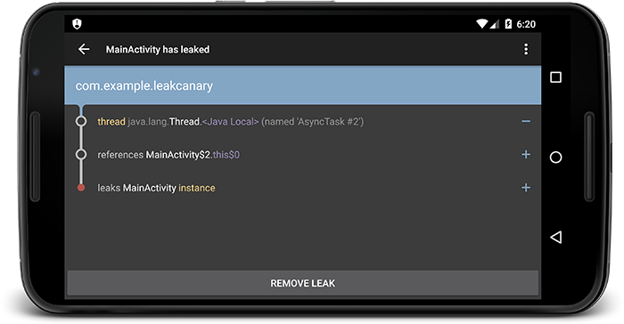

#LeakCanary

A memory leak detection library for Android and Java.

*“A small leak will sink a great ship.”* - Benjamin Franklin



## Getting started

In your `build.gradle`:

```gradle
 dependencies {
   debugCompile 'com.squareup.leakcanary:leakcanary-android:1.3.1'
   releaseCompile 'com.squareup.leakcanary:leakcanary-android-no-op:1.3.1'
 }
```

In your `Application` class:

```java
public class ExampleApplication extends Application {

  @Override public void onCreate() {
    super.onCreate();
    LeakCanary.install(this);
  }
}
```

**You're good to go!** LeakCanary will automatically show a notification when an activity memory leak is detected in your debug build.

## Why should I use LeakCanary?

Glad you ask! We wrote a [blog post](http://squ.re/leakcanary) to answer precisely that question.

## How do I use it?

Use a `RefWatcher` to watch references that should be GCed:

```java
RefWatcher refWatcher = {...};

// We expect schrodingerCat to be gone soon (or not), let's watch it.
refWatcher.watch(schrodingerCat);
```

`LeakCanary.install()` returns a pre configured `RefWatcher`.
It also installs an `ActivityRefWatcher` that automatically detects if an activity is leaking after `Activity.onDestroy()` has been called.

```java
public class ExampleApplication extends Application {

  public static RefWatcher getRefWatcher(Context context) {
    ExampleApplication application = (ExampleApplication) context.getApplicationContext();
    return application.refWatcher;
  }

  private RefWatcher refWatcher;

  @Override public void onCreate() {
    super.onCreate();
    refWatcher = LeakCanary.install(this);
  }
}
```

You could use the `RefWatcher` to watch for fragment leaks:

```java
public abstract class BaseFragment extends Fragment {

  @Override public void onDestroy() {
    super.onDestroy();
    RefWatcher refWatcher = ExampleApplication.getRefWatcher(getActivity());
    refWatcher.watch(this);
  }
}
```

## How does it work?

1. `RefWatcher.watch()` creates a [KeyedWeakReference](https://github.com/square/leakcanary/blob/master/leakcanary-watcher/src/main/java/com/squareup/leakcanary/KeyedWeakReference.java) to the watched object.
2. Later, in a background thread, it checks if the reference has been cleared and if not it triggers a GC.
3. If the reference is still not cleared, it then dumps the heap into a `.hprof` file stored on the app file system.
4. `HeapAnalyzerService` is started in a separate process and `HeapAnalyzer` parses the heap dump using [HAHA](https://github.com/square/haha).
5. `HeapAnalyzer` finds the `KeyedWeakReference` in the heap dump thanks to a unique reference key and locates the leaking reference.
6. `HeapAnalyzer` computes the *shortest strong reference path to the GC Roots* to determine if there is a leak, and then builds the chain of references causing the leak.
7. The result is passed back to `DisplayLeakService` in the app process, and the leak notification is shown.

## How do I copy the leak trace?

You can see the leak trace in Logcat:

```
In com.example.leakcanary:1.0:1 com.example.leakcanary.MainActivity has leaked:
* GC ROOT thread java.lang.Thread.<Java Local> (named 'AsyncTask #1')
* references com.example.leakcanary.MainActivity$3.this$0 (anonymous class extends android.os.AsyncTask)
* leaks com.example.leakcanary.MainActivity instance

* Reference Key: e71f3bf5-d786-4145-8539-584afaecad1d
* Device: Genymotion generic Google Nexus 6 - 5.1.0 - API 22 - 1440x2560 vbox86p
* Android Version: 5.1 API: 22
* Durations: watch=5086ms, gc=110ms, heap dump=435ms, analysis=2086ms
```

You can also share the leak trace and the heap dump file from the **action bar menu**.

## How do I fix a memory leak?

Once you have the leak trace, figure out which reference in the path should not exist. Then figure out why that reference still exists. Often times it's a registered listener that should have been unregistered, a `close()` method that wasn't called, an anonymous class that holds a reference an outer class. If you cannot figure out an issue in your code, **please do not file an issue**. Instead, create a [Stack Overflow question](http://stackoverflow.com/questions/tagged/leakcanary) (using the *leakcanary* tag).

## My leak is caused by the Android SDK implementation!

There are a number of known memory leaks that have been fixed over time in AOSP as well as in manufacturer implementations. When such a leak occurs, there is little you can do as an app developer to fix it. For that reason, LeakCanary has a built-in list of known Android leaks to ignore: [AndroidExcludedRefs.java](https://github.com/square/leakcanary/blob/master/leakcanary-android/src/main/java/com/squareup/leakcanary/AndroidExcludedRefs.java).

If you find a new one, please [create an issue](https://github.com/square/leakcanary/issues/new) and follow these steps:

1. Provide the entire leak trace information (reference key, device, etc).
2. Read the AOSP source for that version of Android, and try to figure out why it happens. You can easily navigate through SDK versions [android/platform_frameworks_base](https://github.com/android/platform_frameworks_base).
3. Check if it happens on the latest version of Android, and otherwise use blame to find when it was fixed.
4. If it's still happening, build a simple repro case
5. File an issue on [b.android.com](http://b.android.com) with the leak trace and the repro case
6. Create a PR in LeakCanary to update `AndroidExcludedRefs.java`. Optional: if you find a hack to clear that leak on previous versions of Android, feel free to document it.

This is especially important for **new releases of Android**. You have the opportunity to help detect new memory leaks early on, which benefits the entire Android community. 

## Beyond the leak trace

Sometimes the leak trace isn't enough and you need to dig into the heap dump with [MAT](http://eclipse.org/mat/) or [YourKit](https://www.yourkit.com/). Here's how you can find the leaking instance in the head dump:

1. Look for all instances of `com.squareup.leakcanary.KeyedWeakReference`
2. For each of these, look at the `key` field.
3. Find the `KeyedWeakReference` that has a `key` field equal to the reference key reported by LeakCanary.
4. The `referent` field of that `KeyedWeakReference` is your leaking object.
5. From then on, the matter is in your hands. A good start is to look at the shortest path to GC Roots (excluding weak references).

## Customizing

### Icon and label

`DisplayLeakActivity` comes with a default icon and label, which you can change by providing `R.drawable.__leak_canary_icon` and `R.string.__leak_canary_display_activity_label` in your app:

```
res/
  drawable-hdpi/
    __leak_canary_icon.png
  drawable-mdpi/
    __leak_canary_icon.png
  drawable-xhdpi/
    __leak_canary_icon.png
  drawable-xxhdpi/
    __leak_canary_icon.png
  drawable-xxxhdpi/
    __leak_canary_icon.png
```

```xml
<?xml version="1.0" encoding="utf-8"?>
<resources>
  <string name="__leak_canary_display_activity_label">MyLeaks</string>
</resources>
```

### Stored leak traces

`DisplayLeakActivity` saves up to 7 heap dumps & leak traces in the app directory. You can change that number by providing `R.integer.__leak_canary_max_stored_leaks` in your app:

```xml
<?xml version="1.0" encoding="utf-8"?>
<resources>
  <integer name="__leak_canary_max_stored_leaks">20</integer>
</resources>
```

### Uploading to a server

You can change the default behavior to upload the leak trace and heap dump to a server of your choosing.

Create your own `AbstractAnalysisResultService`. The easiest way is to extend `DisplayLeakService` in your debug sources:

```java
public class LeakUploadService extends DisplayLeakService {
  @Override protected void afterDefaultHandling(HeapDump heapDump, AnalysisResult result, String leakInfo) {
    if (!result.leakFound || result.excludedLeak) {
      return;
    }
	myServer.uploadLeakBlocking(heapDump.heapDumpFile, leakInfo);
  }
}
```

Make sure the release Application class uses the disabled `RefWatcher`:

```java
public class ExampleApplication extends Application {

  public static RefWatcher getRefWatcher(Context context) {
    ExampleApplication application = (ExampleApplication) context.getApplicationContext();
    return application.refWatcher;
  }

  private RefWatcher refWatcher;

  @Override public void onCreate() {
    super.onCreate();
    refWatcher = installLeakCanary();
  }
  
  protected RefWatcher installLeakCanary() {
    return RefWatcher.DISABLED;
  }
}
```

Build a custom `RefWatcher` in your debug Application class:

```java
public class DebugExampleApplication extends ExampleApplication {
  protected RefWatcher installLeakCanary() {
    return LeakCanary.install(app, LeakUploadService.class, AndroidExcludedRefs.createAppDefaults().build());
  }
}
```

Don't forget to register the service in your debug manifest:

```xml
<?xml version="1.0" encoding="utf-8"?>
<manifest xmlns:android="http://schemas.android.com/apk/res/android"
    xmlns:tools="http://schemas.android.com/tools"
    >
  <application android:name="com.example.DebugExampleApplication">
    <service android:name="com.example.LeakUploadService" />
  </application>
</manifest>
```

You can also upload the leak traces to Slack or HipChat, [here's an example](https://gist.github.com/pyricau/06c2c486d24f5f85f7f0).

### Ignoring specific references

You can create your own version of `ExcludedRefs` to ignore specific references that you know are causing leaks but you still want to ignore:

```java
public class DebugExampleApplication extends ExampleApplication {
  protected RefWatcher installLeakCanary() {
    ExcludedRefs excludedRefs = AndroidExcludedRefs.createAppDefaults()
        .instanceField("com.example.ExampleClass", "exampleField")
        .build();
    return LeakCanary.install(this, DisplayLeakService.class, excludedRefs);
  }
}
```

### Not watching specific activity classes

`ActivityRefWatcher` is installed by default and watches all activities. You can customize the installation steps to use something different instead:

```java
public class DebugExampleApplication extends ExampleApplication {
  protected RefWatcher installLeakCanary() {
    if (isInAnalyzerProcess(this)) {
      return RefWatcher.DISABLED;
    } else {
      ExcludedRefs excludedRefs = AndroidExcludedRefs.createAppDefaults().build();
      enableDisplayLeakActivity(application);
      ServiceHeapDumpListener heapDumpListener = new ServiceHeapDumpListener(application, DisplayLeakService.class);
      final RefWatcher refWatcher = androidWatcher(application, heapDumpListener, excludedRefs);
      registerActivityLifecycleCallbacks(new ActivityLifecycleCallbacks() {
        public void onActivityDestroyed(Activity activity) {
          if (activity instanceof ThirdPartyActivity) {
              return;
          }
          refWatcher.watch(activity);
        }
        // ...
      });
      return refWatcher;
    }
  }
}
```


## Snapshots of the development version

See the [CHANGELOG](https://github.com/square/leakcanary/blob/master/CHANGELOG.md).

## Troubleshooting

* if `leakcanary-android` is not in the list of external libraries in Android Studio, but `leakcanary-analyzer` and `leakcanary-watcher` are there: try doing a `Clean Build`. If it's still a problem, try building from the command line.
* `error: package com.squareup.leakcanary does not exist`: if you have other build types than `debug` and `release`, you need to add a specific dependency for those too (`xxxCompile`).

## Resources

* LeakCanary: Detect all memory leaks! [squ.re/leakcanary](http://squ.re/leakcanary).
* Wrangling Dalvik series: [Memory management in Android](http://www.raizlabs.com/dev/2014/03/wrangling-dalvik-memory-management-in-android-part-1-of-2/).
* Uploading leak traces to a [Slack or HipChat channel](https://gist.github.com/pyricau/06c2c486d24f5f85f7f0).
* Dump the heap on [OutOfMemoryError crashes](https://gist.github.com/pyricau/4726389fd64f3b7c6f32).
* StackOverflow: [leakcanary tag](http://stackoverflow.com/questions/tagged/leakcanary).

### Translations

* squ.re/leakcanary [in Chinese](http://www.liaohuqiu.net/cn/posts/leak-canary/).
* squ.re/leakcanary [in Russian](http://habrahabr.ru/post/257633/).
* `README.md` in Chinese: [中文版说明](http://www.liaohuqiu.net/cn/posts/leak-canary-read-me/).


The name **LeakCanary** is a reference to the expression [canary in a coal mine](http://en.wiktionary.org/wiki/canary_in_a_coal_mine), because LeakCanary is a sentinel used to detect risks by providing advance warning of a danger. Props to [@edenman](https://github.com/edenman) for suggesting it!

## License

    Copyright 2015 Square, Inc.

    Licensed under the Apache License, Version 2.0 (the "License");
    you may not use this file except in compliance with the License.
    You may obtain a copy of the License at

       http://www.apache.org/licenses/LICENSE-2.0

    Unless required by applicable law or agreed to in writing, software
    distributed under the License is distributed on an "AS IS" BASIS,
    WITHOUT WARRANTIES OR CONDITIONS OF ANY KIND, either express or implied.
    See the License for the specific language governing permissions and
    limitations under the License.
