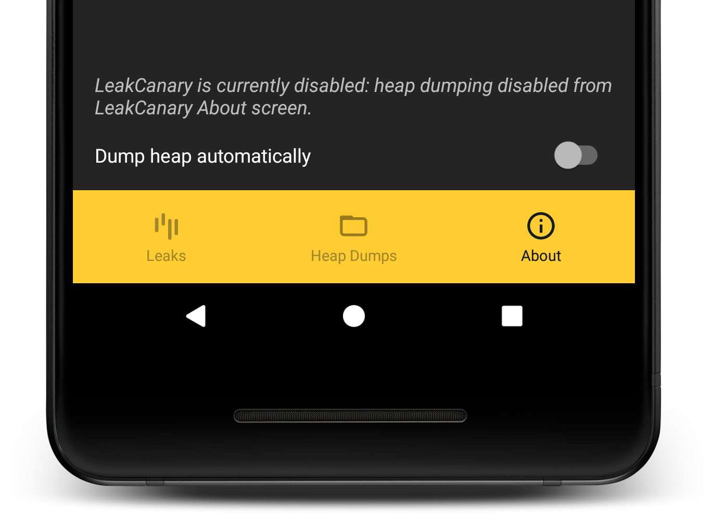
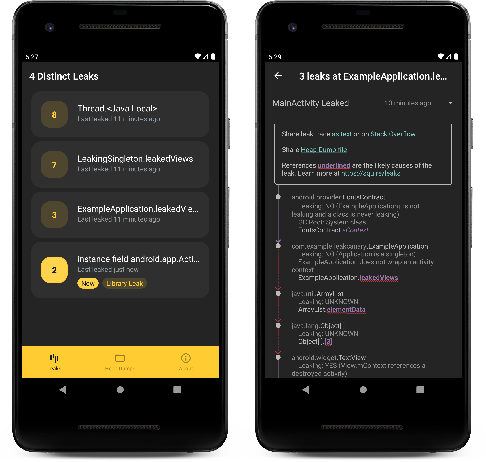

# Change Log

!!! info
    To upgrade from LeakCanary *1.6*, follow the [upgrade guide](upgrading-to-leakcanary-2.0.md).

## Version 2.5 (2020-10-01)

Please thank 
[@Amokrane](https://github.com/Amokrane),
[@Armaxis](https://github.com/Armaxis),
[@askont](https://github.com/askont),
[@chao2zhang](https://github.com/chao2zhang),
[@daniil-shevtsov](https://github.com/daniil-shevtsov),
[@eygraber](https://github.com/eygraber),
[@msfjarvis](https://github.com/msfjarvis),
[@mzgreen](https://github.com/mzgreen),
[@lchen8](https://github.com/lchen8),
[@rpattabi](https://github.com/rpattabi),
[@sahil2441](https://github.com/sahil2441),
[@SylvainGirod](https://github.com/SylvainGirod),
[@vhow](https://github.com/vhow)
for their contributions, bug reports and feature requests 🙏 🙏 🙏.

### Heap analysis is twice as fast 🐤💨

No one asked, so we delivered! We rewrote several core components in Shark (LeakCanary's heap analyzer) to dramatically reduce IO reads and allocations while keeping memory constant. More details on Twitter: [thread by @ArtemChubaryan](https://twitter.com/ArtemChubaryan/status/1311078061895553030) and [thread by @Piwai](https://twitter.com/Piwai/status/1311085280753926144).

### Compute retained size within the leak trace

Previously, LeakCanary computed the retained size for the leaking object (the last object in the leak trace). However, the bad reference causing objects to leak is often higher up in the leak trace and everything that it holds onto is actually leaking. So LeakCanary now computes the retained size for [all the objects in the leaktrace that have a LEAKING or UNKNOWN status](https://github.com/square/leakcanary/issues/1880):

```
┬───
│ GC Root: System class
│
├─ com.example.MySingleton class
│    Leaking: NO (a class is never leaking)
│    ↓ static MySingleton.leakedView
│                         ~~~~~~~~~~
├─ android.widget.TextView instance
│    Leaking: YES (View.mContext references a destroyed activity)
│    Retaining 46326 bytes in 942 objects
│    ↓ TextView.mContext
╰→ com.example.MainActivity instance
​     Leaking: YES (Activity#mDestroyed is true)
​     Retaining 1432 bytes in 36 objects
```

### Disable LeakCanary from the UI

New toggle to disable [heap dumping](https://github.com/square/leakcanary/issues/1886), which can be useful for QA, or when doing a product demo. LeakCanary will still show a notification when an object is retained.



### Deobfuscating hprof files

The [Shark CLI](shark.md#shark-cli) can now [deobfuscate heap dumps](https://github.com/square/leakcanary/issues/1698):

```
brew install leakcanary-shark

shark-cli --hprof heapdump.hprof -m mapping.txt deobfuscate-hprof
```

### Bug fixes and improvements 🐛🔨

* Heap analysis text results now [wrap to a max width](https://github.com/square/leakcanary/issues/1811) when sharing them from the LeakCanary activity or printing to logcat. This will make it harder to miss details that are lost at the end of long lines of text.
* The `leak_canary_watcher_auto_install`, `leak_canary_allow_in_non_debuggable_build` and `leak_canary_plumber_auto_install` resource booleans were [meant to be public](https://github.com/square/leakcanary/issues/1863).
* We sprinkled a few `@JvmStatic` to [help Java consummers](https://github.com/square/leakcanary/issues/1870).
* Fixed [crash when no browser installed](https://github.com/square/leakcanary/pull/1893).
* Use distinct [group for LeakCanary notifications](https://github.com/square/leakcanary/issues/1845).
* The heap analysis result now includes the [heap dump duration](https://github.com/square/leakcanary/pull/1931) because it looks like Android 11 heap dumps are [sometimes super slow](https://issuetracker.google.com/issues/168634429). We also added more [perf related metrics](https://github.com/square/leakcanary/issues/1929).
* [Disable logging](https://github.com/square/leakcanary/issues/1910) when AppWatcher runs in release builds.
* Highlight library leak patterns [directly within the leak traces](https://github.com/square/leakcanary/issues/1916).
* Improved inspections for [Context, View](https://github.com/square/leakcanary/issues/1912) and [ContextImpl](https://github.com/square/leakcanary/pull/1884).


For more details, see the [2.5 Milestone](https://github.com/square/leakcanary/milestone/19) and the [full diff](https://github.com/square/leakcanary/compare/v2.4...v2.5).


## Version 2.4 (2020-06-10)

Please thank
[@0x109](https://github.com/0x109),
[@andersu](https://github.com/andersu),
[@antoniomerlin](https://github.com/antoniomerlin),
[@bishiboosh](https://github.com/bishiboosh),
[@ckesc](https://github.com/ckesc),
[@jrodbx](https://github.com/jrodbx),
[@LouisCAD](https://github.com/LouisCAD),
[@marcardar](https://github.com/marcardar),
[@OlivierGenez](https://github.com/OlivierGenez),
[@pyricau](https://github.com/pyricau),
[@runningcode](https://github.com/runningcode),
[@seljad](https://github.com/seljad),
[@worldsnas](https://github.com/worldsnas)
for their contributions, bug reports and feature requests.

### `plumber-android` is a new artifact that fixes known Android leaks 🚽🔧

LeakCanary reports all leaks, including leaks caused by a known bug in 3rd party code that you do not have control over (reported as [Library leaks](fundamentals-how-leakcanary-works.md#4-categorizing-leaks)). That can be annoying! LeakCanary now ships with a new dependency, `plumber-android`, which performs hacks at runtime to fix some of these known leaks. This releases has fixes for **11 known leaks**, but this is just the beginning. Contributions welcome! 🙏

Note that since the `leakcanary-android` dependency is usually added as a `debugImplementation` dependency, the `plumber-android` is transitively added only in debug builds, so it will not fix leaks in your release builds. You can add the dependency directly as `implementation` to get these fixes in release builds as well:

```groovy
dependencies {
  implementation 'com.squareup.leakcanary:plumber-android:2.4'
}
```

!!! warning
    While several of these fixes already ship in release builds of Square apps, this is the first official release of `plumber-android`, so you should consider it **experimental**. 

### Analyzing leaks from the CLI is easier than ever 🍺

The [Shark CLI](shark.md#shark-cli) can now be installed via [Homebrew](https://brew.sh/)

```
brew install leakcanary-shark
```

You can then look for leaks in apps on any connected device, for example:

```
$ shark-cli --device emulator-5554 --process com.example.app.debug analyze
```

### Support for Android Test Orchestrator 🎼

If you set up LeakCanary to report test failures when detecting leaks in [instrumentation tests](recipes.md#running-leakcanary-in-instrumentation-tests), it [now works](https://github.com/square/leakcanary/issues/1046) with Android Test Orchestrator as well. No change required, LeakCanary will automatically detect thatAndroid Test Orchestrator is running and hook into it.

### No more `master` branch

The branch name `master` comes from the *master / slave* terminology. We renamed the default branch to `main`, a small step towards making the LeakCanary community a safer space. Here's a good [thread on this topic](https://twitter.com/mislav/status/1270388510684598272).

### Bug fixes and improvements 🐛🔨

* URLs in *Library Leak* descriptions are [now clickable](https://github.com/square/leakcanary/issues/1844)
* Fixed [ordering issues](https://github.com/square/leakcanary/issues/1832) causing improper config with manual setup. A related change is that `AppWatcher.Config.enabled` is now deprecated.
* Fixed possible [OutOfMemoryError failure](https://github.com/square/leakcanary/issues/1798) when computing retained size: we were loading to memory large arrays from the heap dump just to get their size.

For more details, see the [2.4 Milestone](https://github.com/square/leakcanary/milestone/18) and the [full diff](https://github.com/square/leakcanary/compare/v2.3...v2.4).

## Version 2.3 (2020-04-08)

This is a minor release on the feature front, but a large release on the documentation front!

Many thanks to
[@adamfit](https://github.com/adamfit),
[@Amokrane](https://github.com/Amokrane),
[@Armaxis](https://github.com/Armaxis),
[@artnc](https://github.com/artnc),
[@burakeregar](https://github.com/burakeregar),
[@ClaasJG](https://github.com/ClaasJG),
[@clementcontet](https://github.com/clementcontet),
[@ckesc](https://github.com/ckesc),
[@cketti](https://github.com/cketti),
[@fbenbassat](https://github.com/fbenbassat),
[@Guneetgstar](https://github.com/Guneetgstar),
[@Igorxp5](https://github.com/Igorxp5),
[@JLLeitschuh](https://github.com/JLLeitschuh),
[@KidAndroid](https://github.com/KidAndroid),
[@ligi](https://github.com/ligi),
[@mzgreen](https://github.com/mzgreen),
[@pyricau](https://github.com/pyricau),
[@sprintuu](https://github.com/sprintuu),
[@tevjef](https://github.com/tevjef),
[@thrlr123](https://github.com/thrlr123)
for the contributions, bug reports and feature requests.

We [asked for help](https://twitter.com/Piwai/status/1253454280758980609) and immediately started seeing more contributions. Thanks all! Check out the [How to help](how_to_help.md) page.

### LeakCanary will now crash in release builds

Despite the documentation insisting on using `debugImplementation`, we've seen apps [ship LeakCanary](https://twitter.com/Piwai/status/1245524534712602624) in **release builds**. Mistakes happen, so we've made that mistake [harder to miss](https://github.com/square/leakcanary/issues/1804) by making LeakCanary **crash when included in release builds**.

Learn More: [LeakCanary in release builds](recipes.md#leakcanary-in-release-builds).

### Doc site 🛀💥

The doc site content has changed quite a bit! We applied advice from [Google's tech writing guide](https://developers.google.com/tech-writing/). If you've been confused by *Library Leaks* before, check out see the new [Categorizing leaks](fundamentals-how-leakcanary-works.md#4-categorizing-leaks) section. Take a look around, let us know what you think.

### Bug fixes and improvements 😉

* The new [deobfuscation Gradle plugin](recipes.md#using-leakcanary-with-obfuscated-apps) wasn't working [with Gradle 3.6](https://github.com/square/leakcanary/issues/1761), this is now fixed. Also removed the requirement for the plugin to be [applied after AGP](https://github.com/square/leakcanary/pull/1816).
* Fixed 2 crashes ([#1768](https://github.com/square/leakcanary/issues/1768) & [#1769](https://github.com/square/leakcanary/issues/1769)) in the LeakCanary UI found by a sneaky monkey runner 🙈.
* The LeakCanary UI updates [immediately](https://github.com/square/leakcanary/issues/1742) when a heap analysis is added or deleted.
* Fixed a crash when [updating from LeakCanary 2.0](https://github.com/square/leakcanary/pull/1800).
* The *About* section of the LeakCanary now surfaces whether heap dumping is [currently enabled](https://github.com/square/leakcanary/issues/1803).
* Fixed process [not exiting](https://github.com/square/leakcanary/issues/1711) in SharkCLI on Windows.
* Improved [error message](https://github.com/square/leakcanary/pull/1823) when obfuscation mappings appear to be missing.

For more details, see the [2.3 Milestone](https://github.com/square/leakcanary/milestone/17) and the [full diff](https://github.com/square/leakcanary/compare/v2.2...v2.3).

## Version 2.2 (2020-02-05)

We've got some good stuff for the first release of the decade!

Many thanks to
[@AndroidInternal](https://github.com/AndroidInternal),
[@Armaxis](https://github.com/Armaxis),
[@lic2050](https://github.com/lic2050),
[@mzgreen](https://github.com/mzgreen),
[@orenktaboola](https://github.com/orenktaboola),
[@personshelldon](https://github.com/personshelldon),
[@Plastix](https://github.com/Plastix),
[@pyricau](https://github.com/pyricau)
for the contributions, bug reports and feature requests.

### ViewModel leak detection

[Android ViewModels](https://developer.android.com/topic/libraries/architecture/viewmodel) are really cool! Their lifecycle is much nicer than fragments or activities, but sometimes mistakes happen. LeakCanary will now automatically detect ViewModel leaks and report any ViewModel instance retained after its `onCleared()` method was called.

### Android TV


LeakCanary is finally coming to big screens near you! Best part - no additional setup is required, just enable it like you would for a [mobile device](getting_started.md). Now whenever there's a leak - you will see a helpful Toast appear with all the details. Make sure to check out our new [Android TV](recipes.md#android-tv) section and chill! 

### Java-friendly Config builders

[It was brought to our attention](https://github.com/square/leakcanary/issues/1714) that configuring `LeakCanary` and `AppWatcher` was a miserable experience from Java code. Well, not anymore!

Now you can use `LeakCanary.Config.Builder` and `AppWatcher.Config.Builder` to have idiomatic Java when updating the configurations. For example:

```
LeakCanary.Config config = LeakCanary.getConfig().newBuilder()
  .retainedVisibleThreshold(3)
  .computeRetainedHeapSize(false)
  .build();
LeakCanary.setConfig(config);
```

If you notice any other problems when using LeakCanary from Java, please [file an issue](https://github.com/square/leakcanary/issues/new?assignees=&labels=type%3A+enhancement&template=3-feature.md&title=)! We take Java-interop seriously and will be happy to improve LeakCanary's API! 

For more details, see the [2.2 Milestone](https://github.com/square/leakcanary/milestone/16) and the [full diff](https://github.com/square/leakcanary/compare/v2.1...v2.2).

## Version 2.1 (2019-12-31)

A special New Year's Eve release 🥳, the next release will be in another decade 😎!

Many thanks to
[@adamfit](https://github.com/adamfit),
[@alexander-smityuk](https://github.com/alexander-smityuk),
[@Armaxis](https://github.com/Armaxis),
[@BraisGabin](https://github.com/BraisGabin),
[@devism](https://github.com/devism),
[@ditclear](https://github.com/ditclear),
[@jrodbx](https://github.com/jrodbx),
[@jstefanowski](https://github.com/jstefanowski),
[@Maragues](https://github.com/Maragues),
[@mzgreen](https://github.com/mzgreen),
[@pyricau](https://github.com/pyricau)
for the contributions, bug reports and feature requests.

### A Gradle plugin for obfuscated apps

It's fairly common for teams to have a QA build that is tested before making the release build. Usually that build will be obfuscated (via Proguard or R8), but also add LeakCanary to detect leaks during QA. This leads to obfuscated leak traces, which are hard to understand 🤯. Check out our new [Gradle deobfuscation plugin](recipes.md#using-leakcanary-with-obfuscated-apps) and rejoice!

### UI <strike>twix</strike> tweaks

In 2.0 we changed the LeakCanary UI and UX, and built a foundation on which 2.1 extends.



* Since 2.0, Leaks are grouped by their distinct signature. In 2.1 there's a `New` tag that will show until you open up a leak. There's also a `Library Leak` tag for leaks that are known to be caused by a bug in the Android Framework or Google libraries, and the library leak description now shows up in the UI.
* The type of the Java objects (class, instance, array) is now displayed in the LeakTrace, e.g. see `FontsContract class` and `ExampleApplication instance` above.
* The type of the GC root now shows up at the root of the leak trace. Makes sense!
* The leak result notification has an importance now set to MAX so that it'll show up right in your face. If you turn it off, the canary will haunt you in your dreams 🐤👻. To save your sanity and your device battery, automatic heap dumps now won't happen more often than once per minute.
* The resource id name for `View` instances is now displayed in the leak trace. You shouldn't look at the [implementation](https://github.com/square/leakcanary/pull/1663).

```
├─ android.widget.TextView instance
│    View.mID = R.id.helper_text
```

### Documentation goodies

* The [Fundamentals](fundamentals.md) page was entirely rewritten, split into 3 pages and moved to its own tab. Please read it and provide feedback!
* At Square, we have been uploading leaks to Bugsnag for 3 years now, so that no leak ever gets missed. Follow [this recipe](recipes.md#uploading-to-bugsnag)!
* Did you know you can [run LeakCanary in a JVM](recipes.md#detecting-leaks-in-jvm-applications)?

### API <strike>breaking</strike> bettering changes

* The APIs of the `Leak` and `LeakTrace` classes have significantly changed, e.g. all `LeakTrace` instances with an identical signature are grouped under the same Leak object. Despite these breaking changes, this release version is a minor update. Oh noes, what about semantic versioning 😱? Ask Don Quixote.
* You can now customize the way LeakCanary finds the leaking objects in the heap dump. For example, here's the configuration SharkCli uses to find leaks in heap dumps of apps that don't even have the LeakCanary dependency:

```kotlin
LeakCanary.config = LeakCanary.config.copy(
    leakingObjectFinder = FilteringLeakingObjectFinder(
        AndroidObjectInspectors.appLeakingObjectFilters
    )
)
```

* LeakCanary automatically disables itself in tests by detecting that the `org.junit.Test` is in the classpath. Unfortunately, some apps ship Junit in their app debug classpath (e.g. when using OkHttp MockWebServer). You can now customize which class is used to detect tests:

```xml
<resources>
  <string name="leak_canary_test_class_name">assertk.Assert</string>
</resources>
```

### Interactive CLI

[Shark CLI](https://github.com/square/leakcanary/releases/download/v2.1/shark-cli-2.1.zip) was rewritten on top of [Clikt](https://github.com/ajalt/clikt):

```bash
$ shark-cli
Usage: shark-cli [OPTIONS] COMMAND [ARGS]...

                 ^`.                 .=""=.
 ^_              \  \               / _  _ \
 \ \             {   \             |  d  b  |
 {  \           /     `~~~--__     \   /\   /
 {   \___----~~'              `~~-_/'-=\/=-'\,
  \                         /// a  `~.      \ \
  / /~~~~-, ,__.    ,      ///  __,,,,)      \ |
  \/      \/    `~~~;   ,---~~-_`/ \        / \/
                   /   /            '.    .'
                  '._.'             _|`~~`|_
                                    /|\  /|\

Options:
  -p, --process NAME              Full or partial name of a process, e.g.
                                  "example" would match "com.example.app"
  -d, --device ID                 device/emulator id
  -m, --obfuscation-mapping PATH  path to obfuscation mapping file
  --verbose / --no-verbose        provide additional details as to what
                                  shark-cli is doing
  -h, --hprof FILE                path to a .hprof file
  --help                          Show this message and exit

Commands:
  interactive   Explore a heap dump.
  analyze       Analyze a heap dump.
  dump-process  Dump the heap and pull the hprof file.
  strip-hprof   Replace all primitive arrays from the provided heap dump with
                arrays of zeroes and generate a new "-stripped.hprof" file.
```

There's a new `interactive` command which enables exploring the heap dump from the command line:

```bash
$ shark-cli -h heapdump.hprof interactive
Enter command [help]:
help

Available commands:
  analyze                   Analyze the heap dump.
  class NAME@ID             Show class with a matching NAME and Object ID.
  instance CLASS_NAME@ID    Show instance with a matching CLASS_NAME and Object
ID.
  array CLASS_NAME@ID       Show array instance with a matching CLASS_NAME and
Object ID.
  ->instance CLASS_NAME@ID  Show path from GC Roots to instance.
  ~>instance CLASS_NAME@ID  Show path from GC Roots to instance, highlighting
suspect references.
  help                      Show this message.
  exit                      Exit this interactive prompt.
```

We're currently exploring the idea of adding [support for SQL queries](https://twitter.com/Piwai/status/1211795647273160704), feedback welcome!

For more details, see the [2.1 Milestone](https://github.com/square/leakcanary/milestone/15) and the [full diff](https://github.com/square/leakcanary/compare/v2.0...v2.1).

## Version 2.0 (2019-11-27)

In the past 7 months, LeakCanary went through 3 alphas and 5 betas, encompassing 23 contributors over 493 commits, 35826 insertions and 10156 deletions.

### Should I upgrade?

**YES!** LeakCanary 2 is so much better, it might make you excited when you see a new memory leak. Follow the [upgrade guide](upgrading-to-leakcanary-2.0.md), you won't regret it!

### So, what's changed since 1.6.3?

**Everything.** The LeakCanary codebase went from **~6000** lines of Java to **~16000** lines of Kotlin, excluding comments & blanks.

!!! question "Isn't Kotlin supposed to drastically reduce the amount of boilerplate code?"
    Absolutely! And it did. But then, we wrote more code.
    LeakCanary used to depend on [HAHA](https://github.com/square/haha), a repackaging of [perflib](https://android.googlesource.com/platform/tools/base/+/2f03004c181baf9d291a9bf992e1b444e83cd82d/perflib/), the heap dump parser used by Android Studio. Unfortunately perflib was slow and used too much memory, so LeakCanary now includes its own heap dump parser: [Shark](shark.md). The extra code comes from Shark, but also from having a lot more automated tests, and an improved UI layer.

One major difference: when the app is in foreground, LeakCanary 2 will not trigger on every retained instance. Instead it will wait until the app goes in background or to reach a threashold of 5 retained instances in foreground. The analysis will then find all the leaks at once, and group identical leaks in the results UI. Please read the [Fundamentals](fundamentals.md) section to learn more!

### Random facts

* You can customize the Leaks launcher icon and label: [learn more here](recipes.md#icon-and-label).
* If you ` press on your main activity launcher icon, you should see a LeakCanary dynamic shortcut. You can then long press that to drop it on your home screen, and the launcher shows that it's the leaks launcher for your app.
* Out of the box, LeakCanary tracks all fragments flavors: AOSP, Support Library and Android X.
* From within the leak screen, you can share a leak to stack overflow. You can also share a heap dump, or import and analyze a heap dump from another device.
* You can run LeakCanary from your computer command line, on any debuggable app even if that app doesn't have LeakCanary: [learn more here](shark.md##shark-cli).
* The new documentation is fully searchable and includes the API documentation. Try the search bar ⤴.
* A large 160Mb heap dump uses 2Gb memory when opening it in Android Studio, but only 40Mb with Shark.

### Changes since 2.0 Beta 5

* Shark CLI supports multiple connected devices [#1642](https://github.com/square/leakcanary/issues/1642)
* Fixed missing sources from Maven Central [#1643](https://github.com/square/leakcanary/issues/1643)
* Updated notification icon to avoid confusion with Twitter DM notifications, and added icons to bottom navigation bar [#1648](https://github.com/square/leakcanary/pull/1648)
* Automatic leak detection for support library fragments [#1611](https://github.com/square/leakcanary/pull/1611)

Many thanks to
[@AndreasBoehm](https://github.com/AndreasBoehm),
[@jrodbx](https://github.com/jrodbx),
[@pyricau](https://github.com/pyricau)
for the contributions, bug reports and feature requests.

For more details, see the [2.0 Milestone](https://github.com/square/leakcanary/milestone/14) and the [full diff](https://github.com/square/leakcanary/compare/v2.0-beta-5...v2.0).

## Version 2.0 Beta 5 (2019-11-25)

* Major bugfix: native gc roots were accidentally ignored in Beta 4, as a result some leaks were not found [#1634](https://github.com/square/leakcanary/issues/1634)
* Fixed Lint warning (`leak_canary_about_message` string triggered *multiple substitutions* warning) [#1630](https://github.com/square/leakcanary/issues/1630)

Many thanks to
[@DanEdgarTarget](https://github.com/DanEdgarTarget),
[@msfjarvis](https://github.com/msfjarvis),
[@PaulWoitaschek](https://github.com/pyricau),
[@pyricau](https://github.com/pyricau),
[@ZacSweers](https://github.com/ZacSweers)
for the contributions, bug reports and feature requests.

For more details, see the [2.0-beta-5 Milestone](https://github.com/square/leakcanary/milestone/13) and the [full diff](https://github.com/square/leakcanary/compare/v2.0-beta-4...v2.0-beta-5).

## Version 2.0 Beta 4 (2019-11-18)

* Improved string rendering for heap analysis results
* UX redesign [#1445](https://github.com/square/leakcanary/issues/1445)
* Support for pattern matching of native reference leaks [#1562](https://github.com/square/leakcanary/issues/1562)
* Added support for deobfuscation using Proguard mapping files in Shark [#1499](https://github.com/square/leakcanary/issues/1499). This isn't directly supported in LeakCanary yet.
* Added support for extracting metadata from the heap dump (see the [recipe](recipes.md#extracting-metadata-from-the-heap-dump)) [#1519](https://github.com/square/leakcanary/issues/1519)
* Improved auto disabling of LeakCanary in Unit and UI tests [#1552](https://github.com/square/leakcanary/issues/1552)
* Several performance improvements when parsing heap dumps
* Fixed several bugs and crashes
* Added new known leak patterns

Many thanks to
[@Armaxis](https://github.com/Armaxis),
[@BraisGabin](https://github.com/BraisGabin),
[@bric3](https://github.com/bric3),
[@elihart](https://github.com/elihart),
[@fernandospr](https://github.com/fernandospr),
[@flickator](https://github.com/flickator),
[@gabrysgab](https://github.com/gabrysgab),
[@JorgeDLS](https://github.com/JorgeDLS),
[@lannyf77](https://github.com/lannyf77),
[@msfjarvis](https://github.com/msfjarvis),
[@mzgreen](https://github.com/mzgreen),
[@ozmium](https://github.com/ozmium),
[@PaulWoitaschek](https://github.com/pyricau),
[@pyricau](https://github.com/pyricau),
[@shelpy](https://github.com/shelpy),
[@vRallev](https://github.com/vRallev),
[@ZacSweers](https://github.com/ZacSweers)
for the contributions, bug reports and feature requests.

For more details, see the [2.0-beta-4 Milestone](https://github.com/square/leakcanary/milestone/12) and the [full diff](https://github.com/square/leakcanary/compare/v2.0-beta-3...v2.0-beta-4).

## Version 2.0 Beta 3 (2019-08-22)

* Baseline memory usage for large hprofs divided by 3 and removed memory spikes [#1543](https://github.com/square/leakcanary/pull/1543)
* Fixed crash when LeakCanary is initialized from another process [#1529](https://github.com/square/leakcanary/issues/1529)
* Java local references are deprioritized to look for longer alternative paths [#1525](https://github.com/square/leakcanary/pull/1525)
* Fixed `JavaLocalPattern` not matching on Lollipop [#1524](https://github.com/square/leakcanary/pull/1524)

Many thanks to
[@Armaxis](https://github.com/Armaxis),
[@elihart](https://github.com/elihart),
[@emartynov](https://github.com/emartynov),
[@hmcgreevy-instil](https://github.com/hmcgreevy-instil),
[@pyricau](https://github.com/pyricau)
for the contributions, bug reports and feature requests.

For more details, see the [2.0-beta-3 Milestone](https://github.com/square/leakcanary/milestone/11) and the [full diff](https://github.com/square/leakcanary/compare/v2.0-beta-2...v2.0-beta-3).

## Version 2.0 Beta 2 (2019-08-02)

* Fixed *Leak analysis failed: Object id not found in heap dump.* [#1516](https://github.com/square/leakcanary/issues/1516)
* 10x speed increase of hprof indexing on large heap dumps [#1520](https://github.com/square/leakcanary/pull/1520)

Many thanks to
[@kolphi](https://github.com/kolphi),
[@pyricau](https://github.com/pyricau),
[@ZacSweers](https://github.com/ZacSweers)
for the contributions, bug reports and feature requests.

For more details, see the [2.0-beta-2 Milestone](https://github.com/square/leakcanary/milestone/10) and the [full diff](https://github.com/square/leakcanary/compare/v2.0-beta-1...v2.0-beta-2).

## Version 2.0 Beta 1 (2019-07-30)

* New standalone library! [Shark](shark.md) is the heap analyzer that powers LeakCanary 2, and it can run in any Java VM. It comes with a [CLI](shark.md#shark-cli): you can now run `shark-cli analyze-process com.example.myapp` from your computer.
* New Heap Explorer directly on device! Open a Heap Analysis in LeakCanary, tap the options menu and select "Heap Explorer". This is still experimental and not very user friendly, contributions welcome!
* **Large API rewrite** to improve usability. If you used the alpha with a customized configuration, there are breaking changes. Of note: LeakSentry became [AppWatcher](/leakcanary/api/leakcanary-object-watcher-android/leakcanary/-app-watcher/), RefWatcher became [ObjectWatcher](/leakcanary/api/leakcanary-object-watcher/leakcanary/-object-watcher/), AndroidExcludedRefs became [AndroidReferenceMatchers](/leakcanary/api/shark-android/shark/-android-reference-matchers/), AnalysisResultListener became [OnHeapAnalyzedListener](/leakcanary/api/leakcanary-android-core/leakcanary/-on-heap-analyzed-listener/), AndroidLeakTraceInspectors became [AndroidObjectInspectors](/leakcanary/api/shark-android/shark/-android-object-inspectors/).
* The entire API surface is now documented and the documentation is available on this website: see the **LeakCanary API** tab at the top.
* Removed the **dependency on Android X**. No more configuration issues! [#1462](https://github.com/square/leakcanary/issues/1462) 
* Added **Proguard rules** for LeakCanary and ObjectWatcher. [#1500](https://github.com/square/leakcanary/pull/1500) 
* Display LeakCanary version in the About screen. [#1448](https://github.com/square/leakcanary/issues/1448) 
* Bug fixes, new reference matchers and object inspectors

Many thanks to
[@arctouch-carlosottoboni](https://github.com/arctouch-carlosottoboni),
[@jemaystermind](https://github.com/jemaystermind),
[@kushagrakumar27](https://github.com/kushagrakumar27),
[@pyricau](https://github.com/pyricau),
[@snkashis](https://github.com/snkashis)
for the contributions, bug reports and feature requests.

For more details, see the [2.0-beta-1 Milestone](https://github.com/square/leakcanary/milestone/9) and the [full diff](https://github.com/square/leakcanary/compare/v2.0-alpha-3...v2.0-beta-1).

## Version 2.0 Alpha 3 (2019-07-04)

* [#1401](https://github.com/square/leakcanary/pull/1401) LeakCanary can now import all hprof files created from prior LeakCanary versions.
* [#1414](https://github.com/square/leakcanary/pull/1414) New API: `RefWatcher.retainedInstances` which returns the instances that are currently considered retained.
* [#1419](https://github.com/square/leakcanary/pull/1419) New APIs: `LeakCanary.Config.maxStoredHeapDumps` (default 7) and `LeakCanary.Config.requestWriteExternalStoragePermission` (default false). LeakCanary won't ask for the external storage permission anymore by default.
* [#1338](https://github.com/square/leakcanary/issues/1338) API change: `LeakCanary.Config.exclusionsFactory` replaced with `LeakCanary.Config.knownReferences` (simpler use), `LeakCanary.Config.leakInspectors` and `LeakCanary.Config.labelers` merged into `LeakCanary.Config.leakTraceInspectors` which provides access to the entire leak trace as well as a new graph oriented API that replaces the low level hprof parser API.
* [#1382](https://github.com/square/leakcanary/issues/1382) LeakCanary now disables automatic heap dumping when running in AndroidX UI tests.
* [#1424](https://github.com/square/leakcanary/pull/1424) API rename: `RefWatcher.hasRetainedReferences` => `RefWatcher.hasRetainedInstances`, `RefWatcher.retainedReferenceCount` => `RefWatcher.retainedInstanceCount`, `RefWatcher.hasWatchedReferences` => `RefWatcher.hasWatchedInstances`, `RefWatcher.removeKeysRetainedBeforeHeapDump` => `RefWatcher.removeInstancesRetainedBeforeHeapDump`, `RefWatcher.clearWatchedReferences` => `RefWatcher.clearWatchedInstances`.
* [#1432](https://github.com/square/leakcanary/pull/1432) [#1438](https://github.com/square/leakcanary/pull/1438) [#1440](https://github.com/square/leakcanary/pull/1440) New "won't fix" leaks and leak trace inspectors
* [#1374](https://github.com/square/leakcanary/issues/1374) [#1364](https://github.com/square/leakcanary/issues/1364) [#1366](https://github.com/square/leakcanary/issues/1366) [#1417](https://github.com/square/leakcanary/issues/1417) [#1399](https://github.com/square/leakcanary/issues/#1399) [#1416](https://github.com/square/leakcanary/issues/1416) [#1407](https://github.com/square/leakcanary/issues/1407) [#1427](https://github.com/square/leakcanary/issues/1427) [#1385](https://github.com/square/leakcanary/issues/1385) Bug and crash fixes

Many thanks to
[@1step2hell](https://github.com/1step2hell),
[@afollestad](https://github.com/afollestad),
[@ansman](https://github.com/ansman),
[@bjdodson](https://github.com/bjdodson),
[@BraisGabin](https://github.com/BraisGabin),
[@EBfVince](https://github.com/EBfVince),
[@jaredsburrows](https://github.com/jaredsburrows),
[@pforhan](https://github.com/pforhan),
[@pyricau](https://github.com/pyricau),
[@tellypresence](https://github.com/tellypresence),
[@wiyarmir](https://github.com/wiyarmir)
for the contributions, bug reports and feature requests.

For more details, see the [2.0-alpha-3 Milestone](https://github.com/square/leakcanary/milestone/8) and the [full diff](https://github.com/square/leakcanary/compare/v2.0-alpha-2...v2.0-alpha-3).

## Version 2.0 Alpha 2 (2019-05-21)

* [#1040](https://github.com/square/leakcanary/pull/1040) Import and analyze hprof files from other devices
* [#1344](https://github.com/square/leakcanary/pull/1344) Computing retained size
* [#1325](https://github.com/square/leakcanary/pull/1325) New notification showing current count of retained instances
* [#1079](https://github.com/square/leakcanary/pull/1079) "Excluded" leaks have been renamed to "Won't fix" leaks to clarify meaning.
* [#1328](https://github.com/square/leakcanary/pull/1328) New leaks are called out in the UI. 
* [#1327](https://github.com/square/leakcanary/pull/1327) LeakSentry can be enabled / disabled and is automatically disabled in non debuggable builds.
* [#1173](https://github.com/square/leakcanary/pull/1173) Experimental: now reporting leaks that only go through weak references (previously reported as "no path to instance")
* [#1339](https://github.com/square/leakcanary/pull/1339) Readded support for Thread name based exclusions
* [#1312](https://github.com/square/leakcanary/pull/1312) Fixed bug causing LeakCanary to stop detecting leaks after the app is killed.
* [#1310](https://github.com/square/leakcanary/pull/1310) [#1313](https://github.com/square/leakcanary/pull/1313) [#1314](https://github.com/square/leakcanary/pull/1314) [#1340](https://github.com/square/leakcanary/pull/1340) [#1337](https://github.com/square/leakcanary/pull/1337) Many API changes
* [#1296](https://github.com/square/leakcanary/pull/1296) [#1293](https://github.com/square/leakcanary/pull/1293) [#1306](https://github.com/square/leakcanary/pull/1306) [#1336](https://github.com/square/leakcanary/pull/1336) Fixed several crashes. 

Many thanks to
[@forrestbice](https://github.com/forrestbice),
[@Foso](https://github.com/Foso),
[@Goddchen](https://github.com/Goddchen),
[@marcosholgado](https://github.com/marcosholgado),
[@orionlee](https://github.com/orionlee),
[@pyricau](https://github.com/pyricau),
[@satoshun](https://github.com/satoshun),
[@ZacSweers](https://github.com/ZacSweers)
for the contributions!

For more details, see the [2.0-alpha-2 Milestone](https://github.com/square/leakcanary/milestone/7) and the [full diff](https://github.com/square/leakcanary/compare/v2.0-alpha-1...v2.0-alpha-2).

## Version 2.0 Alpha 1 (2019-04-23)


* New [logo](https://github.com/square/leakcanary/wiki/FAQ#who-made-the-logo), thanks [@flickator](https://github.com/flickator)!
* Entirely rewritten to **100% Kotlin**
* Multiple leaks detected in one analysis
    * The heap is dumped when the app goes in the background, or when a minimum of 5 leaks is reached in the foreground.
* Leak grouping
    * Leaks that share similar causes are grouped in the UI.
    * New screens to see the list of groups and each group.
    * Improved leaktrace strings to highlight leak causes.
    * Leaks can be shared to Stack Overflow
* New library: **LeakSentry**.
    * Detects when objects are leaking and triggers LeakCanary
    * Can be used independently in production, for instance to report the number of leaking instances on an OutOfMemoryError crash.
* New heap parser
    * Uses **90% less memory and 6 times** faster than the prior heap parser.
    * Runs in the same process as the app on a low priority thread.
    * No more dependency on Perflib and TroveJ. New dependency on Okio.
    * The old parser is still available as `leakcanary-android-perflib` but will be removed after alpha.
* Labelers can add any string content to leak elements
* 0 code setup, just add the one debug dependency.
* Simpler configuration options
* Updated from support library to Android X

Many thanks to
[@BraisGabin](https://github.com/BraisGabin),
[@colinmarsch](https://github.com/colinmarsch),
[@jrodbx](https://github.com/jrodbx),
[@flickator](https://github.com/flickator),
[@JakeWharton](https://github.com/JakeWharton),
[@pyricau](https://github.com/pyricau),
[@WhatsEmo](https://github.com/WhatsEmo)
for the contributions!

For more details, see the [2.0-alpha-1 Milestone](https://github.com/square/leakcanary/milestone/6) and the [full diff](https://github.com/square/leakcanary/compare/v1.6.3...v2.0-alpha-1).

## Version 1.6.3 (2019-01-10)

* [#1163](https://github.com/square/leakcanary/issues/1163) Fixed leaks being incorrectly classified as "no leak" due to missed GC Roots.
* [#1153](https://github.com/square/leakcanary/issues/1153) `LeakCanary.isInAnalyzerProcess` now correctly returns true in the analyzer process prior to any first leak (could be triggered by starting the leak result activity).
* [#1158](https://github.com/square/leakcanary/issues/1158) Stopped enabling DisplayLeakActivity when not using DisplayLeakService.
* [#1135](https://github.com/square/leakcanary/issues/1135) Fixed IndexOutOfBoundsException for leak traces of size 1.
* [#1163](https://github.com/square/leakcanary/issues/1163) Keep "no leak" heap dumps.

Many thanks to
[@KMaragh](https://github.com/KMaragh),
[@pyricau](https://github.com/pyricau),
[@SebRut](https://github.com/SebRut)
for the code contributions!

For more details, see the [1.6.3 Milestone](https://github.com/square/leakcanary/milestone/5) and the [full diff](https://github.com/square/leakcanary/compare/v1.6.2...v1.6.3).


## Version 1.6.2 (2018-10-16)

* [#1067](https://github.com/square/leakcanary/issues/1067) Fixed TransactionTooLargeException crash (leak analysis would never complete).
* [#1061](https://github.com/square/leakcanary/pull/1061) Detection of Fragment view leaks after Fragment#onDestroyView().
* [#1076](https://github.com/square/leakcanary/pull/1076) Added the FOREGROUND_SERVICE permission for Android P.
* [#1062](https://github.com/square/leakcanary/issues/1062) The LeakCanary toast now always shows correctly. It doesn't show if there is no activity in foreground.
* [#1115](https://github.com/square/leakcanary/issues/1115) Reenabled the DisplayLeakActivity icon on fresh installs.
* [#1100](https://github.com/square/leakcanary/pull/1100) Added nullability annotations to improve Kotlin support.
* Updates to excluded leaks ([commits](https://github.com/square/leakcanary/commits/v1.6.2/leakcanary-android/src/main/java/com/squareup/leakcanary/AndroidExcludedRefs.java)).
* Updates to reachability inspectors ([commits](https://github.com/square/leakcanary/commits/v1.6.2/leakcanary-android/src/main/java/com/squareup/leakcanary/AndroidReachabilityInspectors.java)).

Many thanks to
[@fractalwrench](https://github.com/fractalwrench),
[@ZacSweers](https://github.com/ZacSweers),
[@Goddchen](https://github.com/Goddchen),
[@igokoro](https://github.com/igokoro),
[@IlyaGulya](https://github.com/IlyaGulya),
[@JakeWharton](https://github.com/JakeWharton),
[@javmarina](https://github.com/javmarina),
[@jokermonn](https://github.com/jokermonn),
[@jrodbx](https://github.com/jrodbx),
[@Parseus](https://github.com/Parseus),
[@pyricau](https://github.com/pyricau),
[@scottkennedy](https://github.com/scottkennedy)
for the code contributions!

### Public API changes

* Subclasses of `AbstractAnalysisResultService` should now override `onHeapAnalyzed(@NonNull AnalyzedHeap analyzedHeap)` instead of `onHeapAnalyzed(@NonNull HeapDump heapDump, @NonNull AnalysisResult result)`

For more details, see the [1.6.2 Milestone](https://github.com/square/leakcanary/milestone/4) and the [full diff](https://github.com/square/leakcanary/compare/v1.6.1...v1.6.2).

## Version 1.6.1 (2018-06-21)

* [#727](https://github.com/square/leakcanary/issues/727) Improved leak analysis: LeakCanary now identifies and highlights the potential causes of the leak.
* [#1011](https://github.com/square/leakcanary/issues/1011) We noticed that computing the retained heap size could take a long time, so it's now optional and off by default.
* [#633](https://github.com/square/leakcanary/pull/633) Support for detecting leaks in instrumentation tests ([see the wiki](https://github.com/square/leakcanary/wiki/Customizing-LeakCanary#running-leakcanary-in-instrumentation-tests)).
* [#985](https://github.com/square/leakcanary/pull/985) Ability to convert leak traces into stack traces for easy remote reporting ([see the wiki](https://github.com/square/leakcanary/wiki/Customizing-LeakCanary#uploading-to-a-server)).
* [#983](https://github.com/square/leakcanary/issues/983) Support for watching destroyed Fragments.
* [#846](https://github.com/square/leakcanary/issues/846) LeakCanary now uses foreground services and displays a notification when the analysis is in progress. This also fixes crashes when analyzing in background on O+.
* The LeakCanary icon (to start to DisplayLeakActivity) is now hidden by default, and only enabled after the first leak is found.
* [#775](https://github.com/square/leakcanary/issues/775) Fixed crash when sharing heap dumps on O+ and added a dependency to the support-core-utils library.
* [#930](https://github.com/square/leakcanary/pull/930) DisplayLeakActivity has a responsive icon.
* [#685](https://github.com/square/leakcanary/issues/685) Stopped doing IO on main thread in DisplayLeakActivity (fixes StrictMode errors).
* [#999](https://github.com/square/leakcanary/pull/999) Updated HAHA to 2.0.4, which uses Trove4j as an external dependency (from jcenter) instead of rebundling it. This is to clarify licences (Apache v2 vs LGPL 2.1).
* Several bug and crash fixes.

Many thanks to [@AdityaAnand1](https://github.com/AdityaAnand1), [@alhah](https://github.com/alhah), [@christxph](https://github.com/christxph), [@csoon03](https://github.com/csoon03), [@daqi](https://github.com/daqi), [@JakeWharton](https://github.com/JakeWharton), [@jankovd](https://github.com/jankovd), [@jrodbx](https://github.com/jrodbx), [@kurtisnelson](https://github.com/kurtisnelson), [@NightlyNexus](https://github.com/NightlyNexus), [@pyricau](https://github.com/pyricau), [@SalvatoreT](https://github.com/SalvatoreT), [@shmuelr](https://github.com/shmuelr), [@tokou](https://github.com/tokou), [@xueqiushi](https://github.com/xueqiushi)
 for the code contributions!

Note: we made a 1.6 release but quickly followed up with 1.6.1 due to [#1058](https://github.com/square/leakcanary/issues/1058).

### Public API changes

* The installed ref watcher singleton is now available via `LeakCanary.installedRefWatcher()`
* `AnalysisResult.leakTraceAsFakeException()` returns an exception that can be used to report and group leak traces to a tool like Bugsnag or Crashlytics.
* New `InstrumentationLeakDetector` and `FailTestOnLeakRunListener` APIs for detecting leaks in instrumentation tests.
* New `Reachability.Inspector` and `RefWatcherBuilder.stethoscopeClasses()` API to establish reachability and help identify leak causes.
* Watching activities can be disabled with `AndroidRefWatcherBuilder.watchActivities(false)`, watching fragments can be disabled with `AndroidRefWatcherBuilder.watchFragments(false)`
* `LeakCanary.setDisplayLeakActivityDirectoryProvider()` is deprecated and replaced with `LeakCanary.setLeakDirectoryProvider()`
* New `RefWatcherBuilder.computeRetainedHeapSize()` API to enable the computing of the retained heap size (off by default).

For more details, see the [1.6.1 Milestone](https://github.com/square/leakcanary/milestone/3) and the [full diff](https://github.com/square/leakcanary/compare/v1.5.4...v1.6.1).

## Version 1.5.4 *(2017-09-22)*

* Restore Java 7 compatibility in leakcanary-watcher

## Version 1.5.3 *(2017-09-17)*

* Fix broken 1.5.2 [build](https://github.com/square/leakcanary/issues/815)
* Convert leakcanary-watcher from Android library to Java library
* Disable finish animations in RequestStoragePermissionActivity
* Corrected README sample for Robolectric tests

For more details, see the [full diff](https://github.com/square/leakcanary/compare/v1.5.2...v1.5.3).

## Version 1.5.2 *(2017-08-09)*

* New excluded leaks
* Move Leakcanary UI into leak analyzer process
* Ignore computing retained sizes for bitmaps on O+
* Add notification channel for persistent messages on O+
* Exclude permission activity from recents menu
* Updated README and sample for handling Robolectric tests

For more details, see the [full diff](https://github.com/square/leakcanary/compare/v1.5.1...v1.5.2).

## Version 1.5.1 *(2017-04-25)*

* New excluded leaks
* Fix java.util.MissingFormatArgumentException in DisplayLeakService
* Separate task affinities for different apps
* Bump minSdk to 14
* Fix HahaHelper for O Preview
  
For more details, see the [full diff](https://github.com/square/leakcanary/compare/v1.5...v1.5.1).

## Version 1.5 *(2016-09-28)*

* New excluded leaks
* Added `LeakCanary.isInAnalyzerProcess()` to the no-op jar
* Fixed several file access issues:
    * No more cleanup on startup, we rotate the heap dump files on every new heap dump.
    * LeakCanary now falls back to the app directory until it can write to the external storage.
* Leak notifications now each use a distinct notification instead of erasing each other.
* If LeakCanary can't perform a heap dump for any reason (e.g. analysis in progress, debugger attached), it retries later with an exponential backoff.
* Added confirmation dialog when user deletes all leaks.
* Replace the two LeakCanary configuration methods with a builder that provides more flexibility, see `LeakCanary.refWatcher()`.

For more details, see the [full diff](https://github.com/square/leakcanary/compare/v1.4...v1.5).

### Public API changes

* New `HeapAnalyzer.findTrackedReferences()` method for headless analysis when you have no context on what leaked.
* Added `LeakCanary.isInAnalyzerProcess()` to the no-op jar
* Added `LeakCanary.refWatcher()` which returns an `AndroidRefWatcherBuilder` that extends `RefWatcherBuilder` and lets you fully customize the `RefWatcher` instance.
* Removed `LeakCanary.install(Application, Class)` and `LeakCanary.androidWatcher(Context, HeapDump.Listener, ExcludedRefs)`.
* Removed `R.integer.leak_canary_max_stored_leaks` and `R.integer.leak_canary_watch_delay_millis`, those can now be set via `LeakCanary.refWatcher()`.
* Updated the `LeakDirectoryProvider` API to centralize all file related responsibilities.
* `RefWatcher` is now constructed with a `WatchExecutor` which executes a `Retryable`, instead of an `Executor` that executes a `Runnable`.
* `HeapDumper.NO_DUMP` was renamed `HeapDumper.RETRY_LATER`

## Version 1.4 *(2016-09-11)*

* Fix false negative where GC root is of type android.os.Binder [#482](https://github.com/square/leakcanary/issues/482)
* Update HAHA to 2.0.3; clear compiler warnings [#563](https://github.com/square/leakcanary/issues/563) 
* Correct some mistakes in German translation [#516](https://github.com/square/leakcanary/pull/516)
* Don't loop when storage permission denied [#422](https://github.com/square/leakcanary/issues/422)
* Remove old references to "__" prefixed resources [#477](https://github.com/square/leakcanary/pull/477)
* Fix permission crash for DisplayLeakActivity on M [#382](https://github.com/square/leakcanary/issues/382)
* Fix NPE when thread name not found in heap dump [#417](https://github.com/square/leakcanary/issues/417)
* Add version info to stacktrace [#473](https://github.com/square/leakcanary/issues/473)

## Version 1.4-beta2 *(2016-03-23)*

* Add reason for ignoring to analysis result [#365](https://github.com/square/leakcanary/issues/365).
* Lower memory usage when parsing heap dumps on M [#223](https://github.com/square/leakcanary/issues/223).
* Fix NPE in LeakCanaryInternals.isInServiceProcess() [#449](https://github.com/square/leakcanary/issues/449).
* New ignored Android SDK leaks [#297](https://github.com/square/leakcanary/issues/297),[#322](https://github.com/square/leakcanary/issues/322).
* Use leakcanary-android-no-op in test builds [#143](https://github.com/square/leakcanary/issues/143).
* Fixes to allow LeakCanary to work with ProGuard [#398](https://github.com/square/leakcanary/pull/398).
* Optimize png assets [#406](https://github.com/square/leakcanary/pull/406).
* Fix delete button not working on error views [#408](https://github.com/square/leakcanary/pull/408).
* Add German translation [#437](https://github.com/square/leakcanary/pull/437).

## Version 1.4-beta1 *(2016-01-08)*

* Switched to [HAHA 2.0.2](https://github.com/square/haha/blob/master/CHANGELOG.md#version-202-2015-07-20) with uses Perflib instead of MAT under the hood [#219](https://github.com/square/leakcanary/pull/219). This fixes crashes and improves speed a lot.
* We can now parse Android M heap dumps [#267](https://github.com/square/leakcanary/issues/267), although there are still memory issues (see [#223](https://github.com/square/leakcanary/issues/223)).
* Excluded leaks are now reported as well and available in the display leak activity.
* Added ProGuard configuration for [#132](https://github.com/square/leakcanary/issues/132).
* Many new ignored Android SDK leaks.
* Added excluded leaks to text report [#119](https://github.com/square/leakcanary/issues/119).
* Added LeakCanary SHA to text report [#120](https://github.com/square/leakcanary/issues/120).
* Added CanaryLog API to replace the logger: [#201](https://github.com/square/leakcanary/issues/201).
* Renamed all resources to begin with `leak_canary_` instead of `__leak_canary`[#161](https://github.com/square/leakcanary/pull/161)
* No crash when heap dump fails [#226](https://github.com/square/leakcanary/issues/226).
* Add retained size to leak reports [#162](https://github.com/square/leakcanary/issues/162).

### Public API changes

* AnalysisResult.failure is now a `Throwable` instead of an `Exception`. Main goal is to catch and correctly report OOMs while parsing.
* Added ARRAY_ENTRY to LeakTraceElement.Type for references through array entries.
* Renamed `ExcludedRefs` fields.
* Each `ExcludedRef` entry can now be ignored entirely or "kept only if no other path".
* Added support for ignoring all fields (static and non static) for a given class.

## Version 1.3.1 *(2015-05-16)*

* Heap dumps and analysis results are now saved on the sd card: [#21](https://github.com/square/leakcanary/issues/21).
* `ExcludedRef` and `AndroidExcludedRefs` are customizable: [#12](https://github.com/square/leakcanary/issues/12) [#73](https://github.com/square/leakcanary/issues/73).
* 7 new ignored Android SDK leaks: [#1](https://github.com/square/leakcanary/issues/1) [#4](https://github.com/square/leakcanary/issues/4) [#32](https://github.com/square/leakcanary/issues/32) [#89](https://github.com/square/leakcanary/pull/89) [#82](https://github.com/square/leakcanary/pull/82) [#97](https://github.com/square/leakcanary/pull/97).
* Fixed 3 crashes in LeakCanary: [#37](https://github.com/square/leakcanary/issues/37) [#46](https://github.com/square/leakcanary/issues/46) [#66](https://github.com/square/leakcanary/issues/66).
* Fixed StrictMode thread policy violations: [#15](https://github.com/square/leakcanary/issues/15).
* Updated `minSdkVersion` from `9` to `8`: [#57](https://github.com/square/leakcanary/issues/57).
* Added LeakCanary version name to `LeakCanary.leakInfo()`: [#49](https://github.com/square/leakcanary/issues/49).
* `leakcanary-android-no-op` is lighter, it does not depend on `leakcanary-watcher` anymore, only 2 classes now: [#74](https://github.com/square/leakcanary/issues/74).
* Adding field state details to the text leak trace.
* A Toast is displayed while the heap dump is in progress to warn that the UI will freeze: [#20](https://github.com/square/leakcanary/issues/49). You can customize the toast by providing your own layout named `__leak_canary_heap_dump_toast.xml` (e.g. you could make it an empty layout).
* If the analysis fails, the result and heap dump are kept so that it can be reported to LeakCanary: [#102](https://github.com/square/leakcanary/issues/102).
* Update to HAHA 1.3 to fix a 2 crashes [#3](https://github.com/square/leakcanary/issues/3) [46](https://github.com/square/leakcanary/issues/46)

### Public API changes

* When upgrading from 1.3 to 1.3.1, previously saved heap dumps will not be readable any more, but they won't be removed from the app directory. You should probably uninstall your app.
* Added `android.permission.WRITE_EXTERNAL_STORAGE` to `leakcanary-android` artifact.
* `LeakCanary.androidWatcher()` parameter types have changed (+ExcludedRefs).
* `LeakCanary.leakInfo()` parameter types have changed (+boolean)
* `ExcludedRef` is now serializable and immutable, instances can be created using `ExcludedRef.Builder`.
* `ExcludedRef` is available in `HeapDump`
* `AndroidExcludedRefs` is an enum, you can now pick the leaks you want to ignore in `AndroidExcludedRefs` by creating an `EnumSet` and calling `AndroidExcludedRefs.createBuilder()`.
* `AndroidExcludedRefs.createAppDefaults()` & `AndroidExcludedRefs.createAndroidDefaults()` return a `ExcludedRef.Builder`.
* `ExcludedRef` moved from `leakcanary-analyzer` to `leakcanary-watcher`

## Version 1.3 *(2015-05-08)*

Initial release.

### Dependencies
