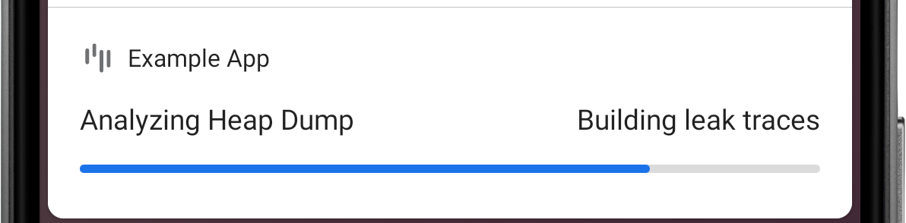

## Detecting retained objects

The foundation of LeakCanary is the `leakcanary-object-watcher-android` library. It hooks into the Android lifecycle to automatically detect when activities and fragments are destroyed and should be garbage collected. These destroyed objects are passed to an `ObjectWatcher`, which holds **weak references** to them. You can watch any objects that is no longer needed, for example a detached view, a destroyed presenter, etc.

```kotlin
AppWatcher.objectWatcher.watch(myDetachedView, "View was detached")
```

If the weak references aren't cleared after **waiting 5 seconds** and running garbage collection, the watched objects are considered **retained**, and potentially leaking. LeakCanary logs this to Logcat:

```
D LeakCanary: Watching instance of com.example.leakcanary.MainActivity
  (Activity received Activity#onDestroy() callback) 

... 5 seconds later ...

D LeakCanary: Scheduling check for retained objects because found new object
  retained
```

LeakCanary waits for the count of retained objects to reach a threshold before dumping the heap, and displays a notification with the latest count.


```
D LeakCanary: Rescheduling check for retained objects in 2000ms because found
  only 4 retained objects (< 5 while app visible)
```

!!! info
    The default threshold is **5 retained objects** when the app is **visible**, and **1 retained object** when the app is **not visible**. If you see the retained objects notification and then put the app in background (for example by pressing the Home button), then the threshold changes from 5 to 1 and LeakCanary dumps the heap within 5 seconds. Tapping the notification forces LeakCanary to dump the heap immediately.

## Dumping the heap

When the count of retained objects reaches a threshold, LeakCanary dumps the Java heap into a `.hprof` file stored onto the Android file system. This freezes the app for a short amount of time, during which LeakCanary displays the following toast:


## Analyzing the heap

LeakCanary parses the `.hprof` file using [Shark](shark.md) and locates the retained objects in that heap dump.


For each retained object, LeakCanary finds the chain of references which prevents that retained object from being garbage collected: its **leak trace**. Leak trace is another name for the *shortest strong reference path from garbage collection roots to a retained object*. 



When the analysis is done, LeakCanary displays a notification with a summary. Notice below how the **4 retained objects** are grouped as **2 distinct leaks**. LeakCanary creates a **signature for each leak trace**, and groups together leaks that have the same signature.


Tapping the notification starts an activity that provides more details. Each row corresponds to a group of leaks with the same signature. LeakCanary will mark a leak as **New** if it's the first time you've seen a leak with that signature.


Tapping into a leak opens up a screen where you can see each retained object and its leak trace. You can toggle between retained objects via a drop down.


The leak signature is the hash of the concatenation of each **<span style="color: #9976a8;">reference</span>** identified as potential cause of the leak, ie each reference **<span style="text-decoration: underline; text-decoration-color: red; text-decoration-style: wavy; color: #9976a8;">displayed with a red underline</span>**:


In the example above, the signature would be computed as:

```kotlin
val signature = sha1Hash(
    "com.example.leakcanary.LeakingSingle.leakedView" +
    "java.util.ArrayList.elementData" +
    "java.lang.Object[].[x]"
)
println(signature)
// d962211eda4d45ac50d88d8f212224116a664968
```

What's next? Learn how to [fix a memory leak](fundamentals-fixing-a-memory-leak.md)!