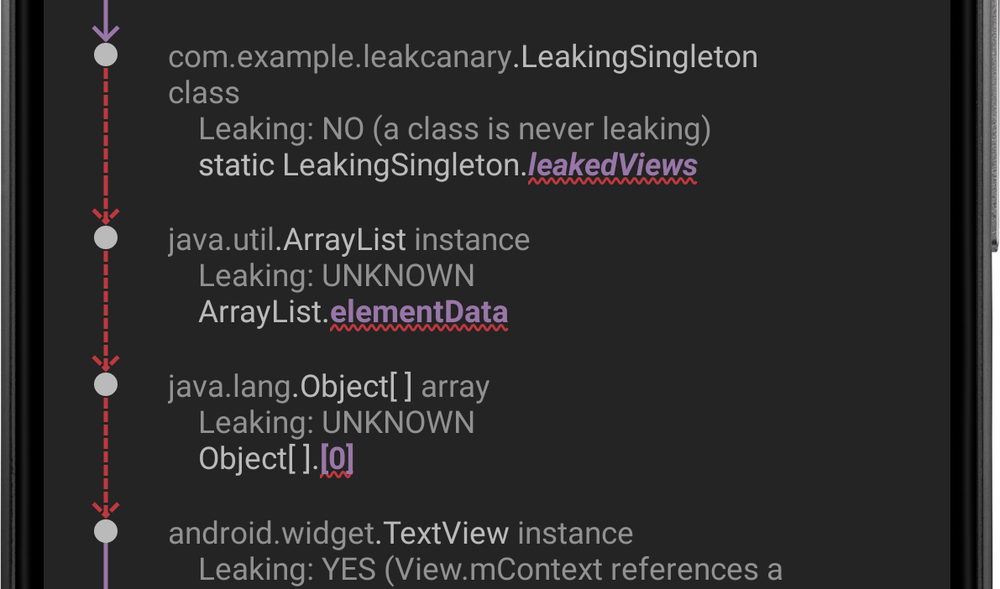

Once LeakCanary is installed, it automatically detects and report memory leaks, in 4 steps:

1. Detecting retained objects.
2. Dumping the heap.
3. Analyzing the heap.
4. Categorizing leaks.

## 1. Detecting retained objects

LeakCanary hooks into the Android lifecycle to automatically detect when activities and fragments are destroyed and should be garbage collected. These destroyed objects are passed to an `ObjectWatcher`, which holds [weak references](https://en.wikipedia.org/wiki/Weak_reference) to them. LeakCanary automatically detects leaks for the following objects:

* destroyed `Activity` instances
* destroyed `Fragment` instances
* destroyed fragment `View` instances
* cleared `ViewModel` instances

You can watch any objects that is no longer needed, for example a detached view or a destroyed presenter:

```kotlin
AppWatcher.objectWatcher.watch(myDetachedView, "View was detached")
```

If the weak reference held by `ObjectWatcher` isn't cleared after **waiting 5 seconds** and running garbage collection, the watched object is considered **retained**, and potentially leaking. LeakCanary logs this to Logcat:

```
D LeakCanary: Watching instance of com.example.leakcanary.MainActivity
  (Activity received Activity#onDestroy() callback) 

... 5 seconds later ...

D LeakCanary: Scheduling check for retained objects because found new object
  retained
```

LeakCanary waits for the count of retained objects to reach a threshold before dumping the heap, and displays a notification with the latest count.


**Figure 1.** LeakCanary found 4 retained objects.

```
D LeakCanary: Rescheduling check for retained objects in 2000ms because found
  only 4 retained objects (< 5 while app visible)
```

!!! info
    The default threshold is **5 retained objects** when the app is **visible**, and **1 retained object** when the app is **not visible**. If you see the retained objects notification and then put the app in background (for example by pressing the Home button), then the threshold changes from 5 to 1 and LeakCanary dumps the heap within 5 seconds. Tapping the notification forces LeakCanary to dump the heap immediately.

## 2. Dumping the heap

When the count of retained objects reaches a threshold, LeakCanary dumps the Java heap into a `.hprof` file (a **heap dump**) stored onto the Android file system (see [Where does LeakCanary store heap dumps?](faq.md#where-does-leakcanary-store-heap-dumps)). Dumping the heap freezes the app for a short amount of time, during which LeakCanary displays the following toast:


**Figure 2.** LeakCanary shows a [toast](https://developer.android.com/guide/topics/ui/notifiers/toasts) while dumping the heap.

## 3. Analyzing the heap

LeakCanary parses the `.hprof` file using [Shark](shark.md) and locates the retained objects in that heap dump.


**Figure 3.** LeakCanary finds retained objects in the heap dump.

For each retained object, LeakCanary finds the path of references that prevents that retained object from being garbage collected: its **leak trace**. You will learn to analyze a leak trace in the next section: [Fixing a memory leak](fundamentals-fixing-a-memory-leak.md).


**Figure 4.** LeakCanary computes the leak trace for each retained object.

When the analysis is done, LeakCanary displays a **notification** with a summary, and also prints the result in **Logcat**. Notice below how the **4 retained objects** are grouped as **2 distinct leaks**. LeakCanary creates a **signature for each leak trace**, and groups together leaks that have the same signature, ie leaks that are caused by the same bug.


**Figure 5.** The 4 leak traces turned into 2 distinct leak signatures.


```
====================================
HEAP ANALYSIS RESULT
====================================
2 APPLICATION LEAKS

Displaying only 1 leak trace out of 2 with the same signature
Signature: ce9dee3a1feb859fd3b3a9ff51e3ddfd8efbc6
┬───
│ GC Root: Local variable in native code
│
...
```

Tapping the notification starts an activity that provides more details. Come back to it again later by tapping the LeakCanary launcher icon:


**Figure 6.** LeakCanary adds a launcher icon for each app it's installed in.

Each row corresponds to a **group of leaks with the same signature**. LeakCanary  marks a row as <span style="border-radius: 20px; background: #ffd24c; padding-left: 8px; padding-right: 8px; padding-top: 2px; padding-bottom: 2px; color: #141c1f;">New</span> the first time the app triggers a leak with that signature.


**Figure 7.** The 4 leaks grouped into 2 rows, one for each distinct leak signature.

Tap on a leak to open up a screen with the leak trace. You can toggle between retained objects and their leak trace via a drop down.


**Figure 8.** A screen showing 3 leaks grouped by their common leak signature.

The **leak signature** is the **hash of the concatenation of each <span style="color: #9976a8;">reference</span> suspected to cause the leak**, ie each reference **<span style="text-decoration: underline; text-decoration-color: red; text-decoration-style: wavy; color: #9976a8;">displayed with a red underline</span>**:


**Figure 9.** A leak trace with 3 suspect references.

These same suspicious references are underlined with `~~~` when the leak trace is shared as text:

```
...
│  
├─ com.example.leakcanary.LeakingSingleton class
│    Leaking: NO (a class is never leaking)
│    ↓ static LeakingSingleton.leakedViews
│                              ~~~~~~~~~~~
├─ java.util.ArrayList instance
│    Leaking: UNKNOWN
│    ↓ ArrayList.elementData
│                ~~~~~~~~~~~
├─ java.lang.Object[] array
│    Leaking: UNKNOWN
│    ↓ Object[].[0]
│               ~~~
├─ android.widget.TextView instance
│    Leaking: YES (View.mContext references a destroyed activity)
...
```

In the example above, the signature of the leak would be computed as:

```kotlin
val leakSignature = sha1Hash(
    "com.example.leakcanary.LeakingSingleton.leakedView" +
    "java.util.ArrayList.elementData" +
    "java.lang.Object[].[x]"
)
println(leakSignature)
// dbfa277d7e5624792e8b60bc950cd164190a11aa
```

## 4. Categorizing leaks

LeakCanary separates the leaks it finds in your app into two categories: **Application Leaks** and **Library Leaks**. A **Library Leak** is a leak caused by a known bug in 3rd party code that you do not have control over. This leak is impacting your application, but unfortunately fixing it may not be in your control so LeakCanary separates it out.

The two categories are separated in the result printed in **Logcat**:

```
====================================
HEAP ANALYSIS RESULT
====================================
0 APPLICATION LEAKS

====================================
1 LIBRARY LEAK

...
┬───
│ GC Root: Local variable in native code
│
...
```

LeakCanary marks a row as a <span style="border-radius: 20px; background: #4e462f; padding-left: 8px; padding-right: 8px; padding-top: 2px; padding-bottom: 2px; color: #ffcc32;">Library Leak</span> in its list of leaks:


**Figure 10.** LeakCanary found a Library Leak.

LeakCanary ships with a database of known leaks, which it recognizes by pattern matching on reference names. For example:

```
Leak pattern: instance field android.app.Activity$1#this$0
Description: Android Q added a new IRequestFinishCallback$Stub class [...]
┬───
│ GC Root: Global variable in native code
│
├─ android.app.Activity$1 instance
│    Leaking: UNKNOWN
│    Anonymous subclass of android.app.IRequestFinishCallback$Stub
│    ↓ Activity$1.this$0
│                 ~~~~~~
╰→ com.example.MainActivity instance
```

!!! quote "What did I do to cause this leak?"
    Nothing wrong! You used an API the way it was intended but the implementation has a bug that is causing this leak.

!!! quote "Is there anything I can do to prevent it?"
    Maybe! Some Library Leaks can be fixed using reflection, others by exercising a code path that makes the leak go away. This type of fix tends to be hacky, so beware! Your best option might be to find the bug report or file one, and insist that the bug gets fixed.

!!! quote "Since I can't do much about this leak, is there a way I can ask LeakCanary to ignore it?"
	There's no way for LeakCanary to know whether a leak is a Library Leak prior to dumping the heap and analyzing it. If LeakCanary didn't show the result notification when a Library Leak is found then you'd start wondering what happened to the LeakCanary analysis after the dumping toast.

You can see the full list of known leaks in the [AndroidReferenceMatchers](https://github.com/square/leakcanary/blob/main/shark-android/src/main/java/shark/AndroidReferenceMatchers.kt#L49) class. If you find an Android SDK leak that isn't recognized, please [report it](faq.md#can-a-leak-be-caused-by-the-android-sdk). You can also [customize the list of known Library Leaks](recipes.md#matching-known-library-leaks).

What's next? Learn how to [fix a memory leak](fundamentals-fixing-a-memory-leak.md)!
