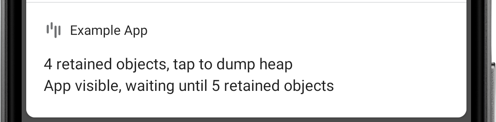
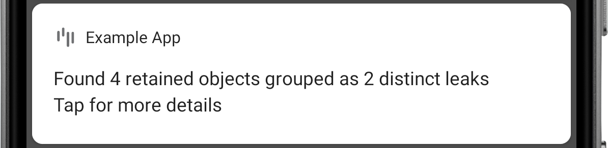

# Fundamentals

## What is a memory leak?

In a Java based runtime, a memory leak is a programming error that causes an application to keep a reference to an object that is no longer needed. As a result, the memory allocated for that object cannot be reclaimed, eventually leading to an OutOfMemoryError crash.

For example, an Android activity instance is no longer needed after its `onDestroy()` method is called, and storing a reference to that activity in a static field would prevent it from being garbage collected.

## Common causes for memory leaks

Most memory leaks are caused by bugs related to the lifecycle of objects. Here are a few common Android mistakes:

* Storing an Activity context as a field in an object that survives activity recreation due to configuration changes.
* Registering a listener, broadcast receiver or RxJava subscription which references an object with lifecycle, and forgetting to unregister when the lifecycle reaches its end.
* Storing a view in a static field, and not clearing that field when the view is detached.

## Why should I use LeakCanary?

Memory leaks are very common in Android apps and the accumulation of small memory leaks causes apps to run out of memory and crash with an OutOfMemoryError (OOM). When we first enabled LeakCanary in the Square Point Of Sale app, we were able to find and fix several leaks and reduced the OOM crash rate by **94%**.

!!! info
    **Most crash reporting tools do not correctly report OOMs**. When memory is low because of memory leak accumulation, an OOM can be thrown from anywhere in the app code, which means every OOM has a different stacktrace. So instead of one crash entry with a 1000 crashes, those get reported as 1000 distinct crashes and hide in the long tail of low occuring crashes.

## How does LeakCanary work?

### Detecting retained objects

The foundation of LeakCanary is a library called *ObjectWatcher Android*. It hooks into the Android lifecycle to automatically detect when activities and fragments are destroyed and should be garbage collected. These destroyed objects are passed to an `ObjectWatcher`, which holds **weak references** to them. You can also watch any objects that is no longer needed, for example a detached view, a destroyed presenter, etc.

```kotlin
AppWatcher.objectWatcher.watch(myDetachedView, "View was detached")
```

If the weak references aren't cleared after **waiting 5 seconds** and running the garbage collector, the watched objects are considered **retained**, and potentially leaking. LeakCanary logs this to Logcat:

```
D LeakCanary: Watching instance of com.example.leakcanary.MainActivity 
// 5 seconds later...
D LeakCanary: Found 1 retained object
```

LeakCanary waits for the count of retained objects to reach a threshold before dumping the heap, and displays a notification with the latest count.



!!! info
    The default threshold is **5 retained objects** when the app is **visible**, and **1 retained object** when the app is **not visible**. If you see the retained objects notification and then put the app in background (for example by pressing the Home button), then the threshold changes from 5 to 1 and LeakCanary dumps the heap immediately. Tapping the notification forces LeakCanary to dump the heap immediately.

### Dumping the heap

When the count of retained objects reaches a threshold, LeakCanary dumps the Java heap into a `.hprof` file stored onto the Android file system. This freezes the app for a short amount of time, during which LeakCanary displays the following toast:


### Analyzing the heap

LeakCanary parses the `.hprof` file using [Shark](shark.md) and locates the retained objects in that heap dump. If the retained objects cannot be found then they were most likely garbage collected by the time the heap was dumped:


For each retained object, LeakCanary finds the chain of references that prevents retained objects from being garbage collected: the **leak trace**. Leak trace is another name for the *shortest strong reference path from garbage collection roots to a retained object*. Once a leak trace is determined, LeakCanary uses its built-in knowledge of the Android framework to deduct which objects in the leak trace are leaking (see below [How do I fix a memory leak?](#how-do-i-fix-a-memory-leak)).

When the analysis is done, LeakCanary displays a notification that can be tapped to see the analysis result:



!!! info
    Using the leak status information, LeakCanary narrows down the reference chain to a sub chain of possible leak causes, and displays the result. Leaks that have the same causal chain are considered to be the same leak, so leaks are grouped by identical sub chain. This is how LeakCanary determines whether a leak is new or not.

## How do I fix a memory leak?

For each leaking object, LeakCanary computes a leak trace and displays it in its UI:


The leak trace is also logged to Logcat:

```
    ┬
    ├─ leakcanary.internal.InternalLeakCanary
    │    Leaking: NO (it's a GC root and a class is never leaking)
    │    ↓ static InternalLeakCanary.application
    ├─ com.example.leakcanary.ExampleApplication
    │    Leaking: NO (Application is a singleton)
    │    ↓ ExampleApplication.leakedViews
    │                         ~~~~~~~~~~~
    ├─ java.util.ArrayList
    │    Leaking: UNKNOWN
    │    ↓ ArrayList.elementData
    │                ~~~~~~~~~~~
    ├─ java.lang.Object[]
    │    Leaking: UNKNOWN
    │    ↓ array Object[].[0]
    │                     ~~~
    ├─ android.widget.TextView
    │    Leaking: YES (View detached and has parent)
    │    View#mAttachInfo is null (view detached)
    │    View#mParent is set
    │    View.mWindowAttachCount=1
    │    ↓ TextView.mContext
    ╰→ com.example.leakcanary.MainActivity
    ​     Leaking: YES (RefWatcher was watching this and MainActivity#mDestroyed
is true)
```

### Objects and references

```
├─ android.widget.TextView
```

Each node in the leak trace is a Java object and is either a class, an object array or an instance.

```
│    ↓ TextView.mContext
```

Going down, each node has a reference to the next node. In the UI, that reference is in **<span style="color:#9976a8">purple</span>**. In the Logcat representation, the reference is on the line that starts with a down arrow.

### GC Root

```
    ┬
    ├─ leakcanary.internal.InternalLeakCanary
    │    Leaking: NO (it's a GC root and a class is never leaking)
```

At the top of the leak trace is a garbage-collection (GC) root. GC roots are special objects that are always reachable. There are four kinds of GC roots worth mentioning:

  * **Local variables**, which belong to the stack of a thread.
  * Instances of **active Java threads**.
  * **Classes**, which never unload on Android.
  * **Native references**, which are controlled by native code.

### Leaking object

```
    ╰→ com.example.leakcanary.MainActivity
    ​     Leaking: YES (RefWatcher was watching this and MainActivity#mDestroyed
is true)
```

At the bottom of the leak trace is the leaking object. This object was passed to [AppWatcher.objectWatcher](/leakcanary/api/leakcanary-object-watcher-android/leakcanary/-app-watcher/object-watcher/) to confirm it would be garbage collected, and it ended up not being garbage collected which triggered LeakCanary.

### Chain of references

```
...
    │    ↓ static InternalLeakCanary.application
...
    │    ↓ ExampleApplication.leakedViews
...
    │    ↓ ArrayList.elementData
...
    │    ↓ array Object[].[0]
...
    │    ↓ TextView.mContext
...
```

The chain of references from the GC root to the leaking object is what is preventing the leaking object from being garbage collected. If you can identify the reference that should not exist at that point in time, then you can figure out why it's incorrectly still set and then fix the memory leak.

### Heuristics and labels

```
    ├─ android.widget.TextView
    │    Leaking: YES (View detached and has parent)
    │    View#mAttachInfo is null (view detached)
    │    View#mParent is set
    │    View.mWindowAttachCount=1
```

LeakCanary runs heuristics to determine the lifecycle state of the nodes of the leak trace, and therefore whether they are leaking or not. For example, if a view has `View#mAttachInfo = null` and `mParent != null` then it is detached yet has a parent, so that view is probably leaking. In the leak trace, for each node you'll see `Leaking: YES / NO / UNKNOWN` with an explanation in parenthesis. LeakCanary can also surface extra information about the state of a node, e.g. `View.mWindowAttachCount=1`. LeakCanary comes with a set of default heuristics: [AndroidObjectInspectors](/leakcanary/api/shark-android/shark/-android-object-inspectors/). You can add your own heuristics by updating [LeakCanary.Config.objectInspectors](/leakcanary/api/leakcanary-android-core/leakcanary/-leak-canary/-config/object-inspectors/) (see the [recipe](recipes.md#identifying-leaking-objects-and-labeling-objects)).

### Narrowing down the cause of a leak

```
    ┬
    ├─ android.provider.FontsContract
    │    Leaking: NO (ExampleApplication↓ is not leaking and a class is never leaking)
    │    GC Root: System class
    │    ↓ static FontsContract.sContext
    ├─ com.example.leakcanary.ExampleApplication
    │    Leaking: NO (Application is a singleton)
    │    ExampleApplication does not wrap an activity context
    │    ↓ ExampleApplication.leakedViews
    │                         ~~~~~~~~~~~
    ├─ java.util.ArrayList
    │    Leaking: UNKNOWN
    │    ↓ ArrayList.elementData
    │                ~~~~~~~~~~~
    ├─ java.lang.Object[]
    │    Leaking: UNKNOWN
    │    ↓ array Object[].[1]
    │                     ~~~
    ├─ android.widget.TextView
    │    Leaking: YES (View.mContext references a destroyed activity)
    │    ↓ TextView.mContext
    ╰→ com.example.leakcanary.MainActivity
    ​     Leaking: YES (TextView↑ is leaking and Activity#mDestroyed is true and ObjectWatcher was watching this)
```

If a node is not leaking, then any prior reference that points to it is not the source of the leak, and also not leaking. Similarly, if a node is leaking then any node down the leak trace is also leaking. From that, we can deduce that the leak is caused by a reference that is after the last `Leaking: NO`	and before the first `Leaking: YES`.

LeakCanary highlights those references with a **<span style="text-decoration: underline; text-decoration-color: red; text-decoration-style: wavy;">red underline</span>** in the UI, or a **~~~~** underline in the Logcat representation. These highlighted references are the **only possible causes of the leak**. These are the references you should spend time investigating.

In this example, the last `Leaking: NO` is on `com.example.leakcanary.ExampleApplication` and the first `Leaking: YES` is on `android.widget.TextView`, so the leak is caused by one of the 3 references in between:

```
...
    │    ↓ ExampleApplication.leakedViews
    │                         ~~~~~~~~~~~
...
    │    ↓ ArrayList.elementData
    │                ~~~~~~~~~~~
...
    │    ↓ array Object[].[0]
    │                     ~~~
...
```

Looking at the [source](https://github.com/square/leakcanary/blob/master/leakcanary-android-sample/src/main/java/com/example/leakcanary/ExampleApplication.kt#L23), we can see that `ExampleApplication` has a list field:

```
open class ExampleApplication : Application() {
  val leakedViews = mutableListOf<View>()
}
```

It's unlikely that there's a bug in the `ArrayList` implementation itself, so the leak happens because we're adding views to `ExampleApplication.leakedViews`. If we stop doing that, we've fixed the leak!

### Asking for help with a leak

If you cannot figure out a leak, **please do not file an issue**. Instead, create a [Stack Overflow question](http://stackoverflow.com/questions/tagged/leakcanary?sort=active) using the *leakcanary* tag.

## LeakCanary artifacts

LeakCanary is released as several libraries:

* Shark
    * The heap analyzer that powers LeakCanary.
    * See [Shark](shark.md) for details.
* ObjectWatcher
    * Used to watch retained objects and check if they become weakly reachable.
    * Suitable for release builds.
    * Artifact id: `com.squareup.leakcanary:leakcanary-object-watcher`.
* ObjectWatcher Android
    * Automatically detects retained destroyed activities and fragments.
    * Suitable for release builds.
    * Artifact id: `com.squareup.leakcanary:leakcanary-object-watcher-android`.
* LeakCanary
    * Dumps the heap and analyzes it.
    * Currently only suitable for debug builds.
    * Depends on ObjectWatcher Android.
    * Artifact id: `com.squareup.leakcanary:leakcanary-android`.
* LeakCanary for Instrumentation tests
    * Fails tests if a leak is detected.
    * Only suitable for Instrumentation tests.
    * Configures LeakCanary to wait for the end of tests before dumping the heap.
    * Artifact id: `com.squareup.leakcanary:leakcanary-android-instrumentation`.
    * See [Running LeakCanary in instrumentation tests](recipes.md#running-leakcanary-in-instrumentation-tests).
* LeakCanary Android separate process
	* Enables running LeakCanary separately from the main app process.
	* Artifact id: `com.squareup.leakcanary:leakcanary-android-process` (as a replacement for `com.squareup.leakcanary:leakcanary-android`).
	* See [Running the LeakCanary analysis in a separate process](recipes.md#running-the-leakcanary-analysis-in-a-separate-process).
