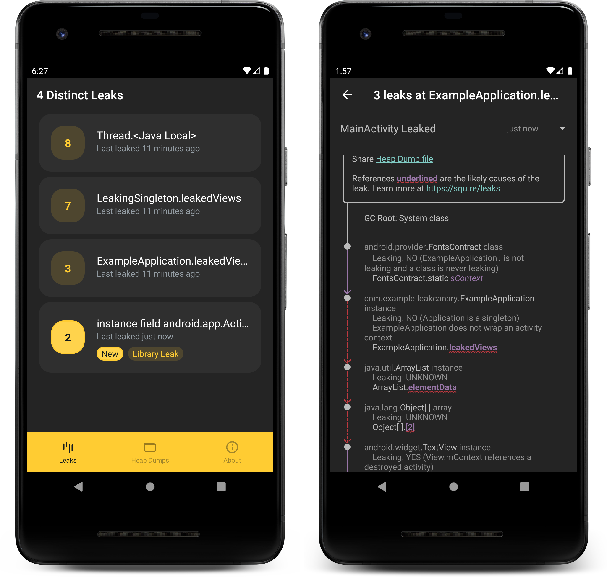

# LeakCanary 🐤

LeakCanary is a memory leak detection library for Android.

LeakCanary's knowledge of the internals of the Android Framework gives it a unique ability to narrow down the cause of each leak, helping developers dramatically reduce `OutOfMemoryError` crashes.

[Get started!](getting_started.md)

!!! quote
    *“A small leak will sink a great ship.”* - Benjamin Franklin

