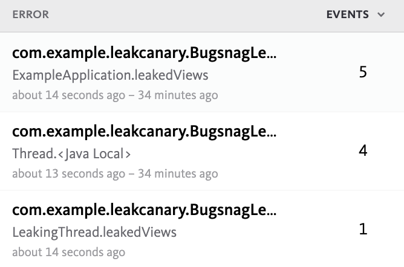
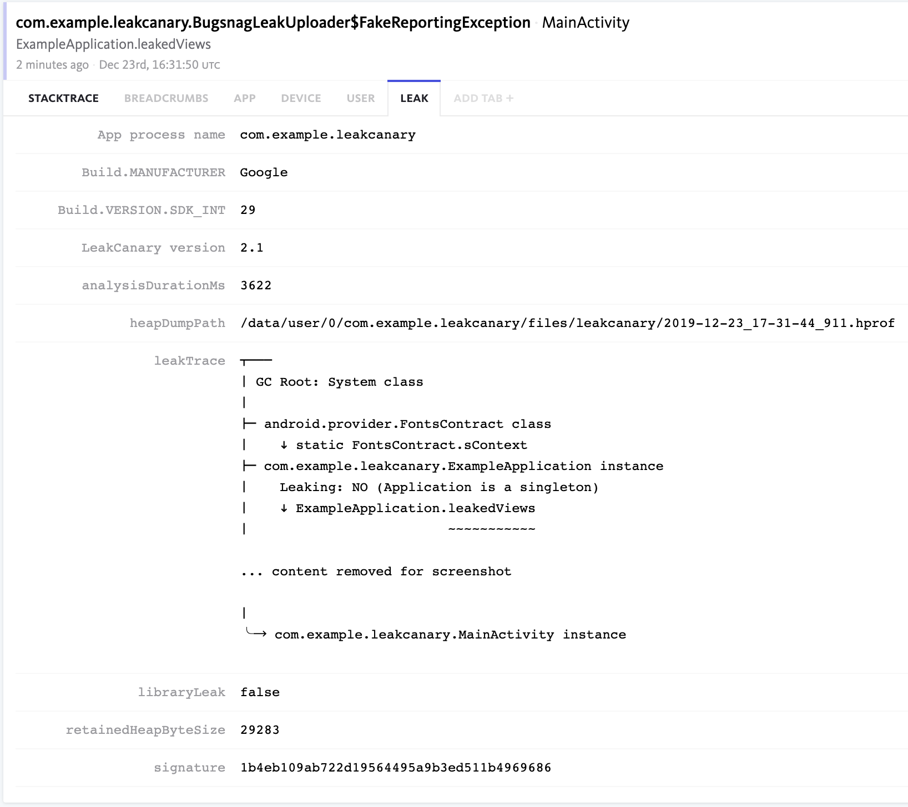

# Code Recipes

This page contains code recipes to customize LeakCanary to your needs. Read through the section titles and cook your own meal! Also don't forget to check out the [FAQ](faq.md).

!!! bug
    If you think a recipe might be missing or you're not sure that what you're trying to achieve is possible with the current APIs, please [file an issue](https://github.com/square/leakcanary/issues/new/choose). Your feedback helps us make LeakCanary better for the entire community.

## Watching objects with a lifecycle

The default configuration of LeakCanary will automatically watch Activity, Fragment, Fragment View and ViewModel instances.

In your application, you may have other objects with a lifecycle, such as services, Dagger components, etc. Use [AppWatcher.objectWatcher](/leakcanary/api/leakcanary-object-watcher-android/leakcanary/-app-watcher/object-watcher/) to watch instances that should be garbage collected:

```kotlin
class MyService : Service {

  // ...

  override fun onDestroy() {
    super.onDestroy()
    AppWatcher.objectWatcher.watch(
      watchedObject = this,
      description = "MyService received Service#onDestroy() callback"
    )
  }
}
```

## Configuration

LeakCanary has a default configuration that works well for most apps. You can also customize it to your needs. The LeakCanary configuration is held by two singleton objects (`AppWatcher` and `LeakCanary`) and can be updated at any time. Most developers configure LeakCanary in their **debug** [Application](https://developer.android.com/reference/android/app/Application) class:

```kotlin
class DebugExampleApplication : ExampleApplication() {

  override fun onCreate() {
    super.onCreate()
    AppWatcher.config = AppWatcher.config.copy(watchFragmentViews = false)
  }
}
```

!!! info
    Create a debug application class in your `src/debug/java` folder. Don't forget to also register it in `src/debug/AndroidManifest.xml`.

To customize the detection of retained objects at runtime, update [AppWatcher.config](/leakcanary/api/leakcanary-object-watcher-android/leakcanary/-app-watcher/config/):

```kotlin
AppWatcher.config = AppWatcher.config.copy(watchFragmentViews = false)
```

To customize the heap dumping & analysis, update [LeakCanary.config](/leakcanary/api/leakcanary-android-core/leakcanary/-leak-canary/config/):

```kotlin
LeakCanary.config = LeakCanary.config.copy(retainedVisibleThreshold = 3)
```

!!! info "Java"
    In Java, use [AppWatcher.Config.Builder](/leakcanary/api/leakcanary-object-watcher-android/leakcanary/-app-watcher/-config/-builder/) and [LeakCanary.Config.Builder](/leakcanary/api/leakcanary-android-core/leakcanary/-leak-canary/-config/-builder/) instead:
    
    ```java
    AppWatcher.Config config = AppWatcher.getConfig().newBuilder()
       .watchFragmentViews(false)
       .build();
    AppWatcher.setConfig(config);
    ```
    
    ```java
    LeakCanary.Config config = LeakCanary.getConfig().newBuilder()
       .retainedVisibleThreshold(3)
       .build();
    LeakCanary.setConfig(config);
    ```

Configure the LeakCanary UI by overriding the following resources:

* `mipmap/leak_canary_icon` see [Icon and label](#icon-and-label)
* `string/leak_canary_display_activity_label` see [Icon and label](#icon-and-label)
* `bool/leak_canary_add_dynamic_shortcut` see [Disabling LeakCanary](#disabling-leakcanary)
* `bool/leak_canary_add_launcher_icon` see [Disabling LeakCanary](#disabling-leakcanary)
* `layout/leak_canary_heap_dump_toast` the layout for the toast shown when the heap is dumped

## Disabling LeakCanary

Sometimes it's necessary to disable LeakCanary temporarily, for example for a product demo or when running performance tests. You have different options, depending on what you're trying to achieve:

* Create a build variant that does not include the LeakCanary dependencies, see [Setting up LeakCanary for different product flavors](#setting-up-leakcanary-for-different-product-flavors).
* Disable the heap dumping & analysis: `LeakCanary.config = LeakCanary.config.copy(dumpHeap = false)`.
* Hide the leak display activity launcher icon: override `R.bool.leak_canary_add_launcher_icon` or call `LeakCanary.showLeakDisplayActivityLauncherIcon(false)`

!!! info
    When you set `LeakCanary.Config.dumpHeap` to `false`, `AppWatcher.objectWatcher` will still keep track of retained objects, and LeakCanary will look for these objects when you change `LeakCanary.Config.dumpHeap` back to `true`.

## Counting retained instances in release builds

The `com.squareup.leakcanary:leakcanary-android` dependency should only be used in debug builds. It depends on `com.squareup.leakcanary:leakcanary-object-watcher-android` which you can use in release builds to track and count retained instances.

In your `build.gradle`:

```gradle
dependencies {
  implementation 'com.squareup.leakcanary:leakcanary-object-watcher-android:{{ leak_canary.release }}'
}
```

In your leak reporting code:
```kotlin
val retainedInstanceCount = AppWatcher.objectWatcher.retainedObjectCount
```

## LeakCanary in release builds

We **do not recommend** including LeakCanary in release builds, as it could negatively impact the experience of your customers. To avoid accidentally including the `com.squareup.leakcanary:leakcanary-android` dependency in a release build, LeakCanary crashes during initialization if the APK is not debuggable. You may have a good reason to create a non debuggable build that includes LeakCanary, for example for a QA build. If necessary, the crashing check can be disabled by overriding the `bool/leak_canary_allow_in_non_debuggable_build` resource, e.g. by creating a file under `res/values` with the following contents:

```xml
<?xml version="1.0" encoding="utf-8"?>
<resources>
  <bool name="leak_canary_allow_in_non_debuggable_build">true</bool>
</resources>
```

## Running LeakCanary in instrumentation tests

Running leak detection in UI tests means you can detect memory leaks automatically in Continuous Integration prior to those leaks being merged into the codebase. However, as LeakCanary runs with a 5 seconds delay and freezes the VM to take a heap dump, this can introduce flakiness to the UI tests. Therefore it is automatically disabled by setting `LeakCanary.config.dumpHeap` to `false` when JUnit is on the runtime classpath.

LeakCanary provides an artifact dedicated to detecting leaks in UI tests which provides a run listener that waits for the end of a test, and if the test succeeds then it look for retained objects, trigger a heap dump if needed and perform an analysis.

To set it up, add the `leakcanary-android-instrumentation` dependency to your instrumentation tests:

```
androidTestImplementation "com.squareup.leakcanary:leakcanary-android-instrumentation:${leakCanaryVersion}"
```

Add the dedicated run listener to `defaultConfig` in your `build.gradle`:

```
android {
  defaultConfig {
    // ...

    testInstrumentationRunner "android.support.test.runner.AndroidJUnitRunner"
    testInstrumentationRunnerArgument "listener", "leakcanary.FailTestOnLeakRunListener"	

    // If you're using Android Test Orchestrator
    testOptions {
      execution 'ANDROIDX_TEST_ORCHESTRATOR'
    }
  }
}
```

Run the instrumentation tests:

```
./gradlew leakcanary-android-sample:connectedCheck
```

You can extend `FailTestOnLeakRunListener` to customize the behavior.

!!! bug "Obfuscated instrumentation tests"
	When running instrumentation tests against obfuscated release builds, the LeakCanary classes end up spread over the test APK and the main APK. Unfortunately there is
	a [bug](https://issuetracker.google.com/issues/126429384) in the Android Gradle Plugin that leads to runtime crashes when running tests, because code from the main APK is changed without the using code in the test APK being updated accordingly. If you run into this issue, setting up the [Keeper plugin](https://slackhq.github.io/keeper/) should fix it.

## Android TV

LeakCanary works on Android TV devices (FireTV, Nexus player, Nvidia Shield, MiBox, etc.) without any additional setup. However, there are couple things you need to be aware of:

-   Android TV doesn't have notifications. LeakCanary will display Toast messages when objects become retained and when leak analysis completes. You can also check Logcat for more details.
-   Due to lack of notifications, the only way to **manually** trigger a heap dump is to background the app.  
-   There's a [bug on API 26+ devices](https://issuetracker.google.com/issues/141429184) that prevents the activity that displays leaks from appearing in apps list. As a workaround, LeakCanary prints an `adb shell` command in Logcat after heap dump analysis that launches leak list activity:
    ```
    adb shell am start -n "com.your.package.name/leakcanary.internal.activity.LeakLauncherActivity"
    ``` 
-   Some Android TV devices have very little memory available per app process and this might impact LeakCanary. [Running the LeakCanary analysis in a separate process](#running-the-leakcanary-analysis-in-a-separate-process) might help in such cases.

## Icon and label

The activity that displays leaks comes with a default icon and label, which you can change by providing `R.mipmap.leak_canary_icon` and `R.string.leak_canary_display_activity_label` in your app:

```
res/
  mipmap-hdpi/
    leak_canary_icon.png
  mipmap-mdpi/
    leak_canary_icon.png
  mipmap-xhdpi/
    leak_canary_icon.png
  mipmap-xxhdpi/
    leak_canary_icon.png
  mipmap-xxxhdpi/
    leak_canary_icon.png
   mipmap-anydpi-v26/
     leak_canary_icon.xml
```

```xml
<?xml version="1.0" encoding="utf-8"?>
<resources>
  <string name="leak_canary_display_activity_label">MyLeaks</string>
</resources>
```

## Customizing the handling of analysis results

You can change the default behavior of what to do when LeakCanary is done analyzing a heap dump, for example to upload the analysis result to a server of your choosing.

Create a custom [OnHeapAnalyzedListener](/leakcanary/api/leakcanary-android-core/leakcanary/-on-heap-analyzed-listener/) that delegates to [DefaultOnHeapAnalyzedListener](/leakcanary/api/leakcanary-android-core/leakcanary/-default-on-heap-analyzed-listener/): 

```kotlin
class LeakUploader : OnHeapAnalyzedListener {

  val defaultListener = DefaultOnHeapAnalyzedListener.create()

  override fun onHeapAnalyzed(heapAnalysis: HeapAnalysis) {
    TODO("Upload heap analysis to server")

    // Delegate to default behavior (notification and saving result)
    defaultListener.onHeapAnalyzed(heapAnalysis)
  }
}
```

!!! info
    `HeapAnalysis.toString()` returns a large string describing the analysis result and metadata. This string is formatted to be printable to Logcat and shareable on sites like StackOverflow.

Set [LeakCanary.config.onHeapAnalyzedListener](/leakcanary/api/leakcanary-android-core/leakcanary/-leak-canary/-config/on-heap-analyzed-listener/):

```kotlin
class DebugExampleApplication : ExampleApplication() {

  override fun onCreate() {
    super.onCreate()
    LeakCanary.config = LeakCanary.config.copy(onHeapAnalyzedListener = LeakUploader())
  }
}
```

## Uploading to Bugsnag

A leak trace has a lot in common with a stack trace, so if you lack the engineering resources to build a backend for LeakCanary, you can instead upload leak traces to a crash reporting backend. The client needs to support grouping via custom client-side hashing as well as custom metadata with support for newlines.

!!! info
    As of this writing, the only known library suitable for uploading leaks is the Bugsnag client. If you managed to make it work with another library, please [file an issue](https://github.com/square/leakcanary/issues/new/choose).

Create a [Bugsnag account](https://app.bugsnag.com/user/new/), create a new project for leak reporting and grab an **API key**. Make sure the app has the `android.permission.INTERNET` permission then add the [latest version](https://docs.bugsnag.com/platforms/android/) of the Bugsnag Android client library to `build.gradle`:

```groovy
dependencies {
  // debugImplementation because LeakCanary should only run in debug builds.
  debugImplementation 'com.squareup.leakcanary:leakcanary-android:{{ leak_canary.release }}'
  debugImplementation "com.bugsnag:bugsnag-android:$bugsnagVersion"
}
```

!!! info
    If you're only using Bugsnag for uploading leaks, then you do not need to set up the Bugsnag Gradle plugin or to configure the API key in your app manifest.


Create a new `BugsnagLeakUploader`:

```kotlin
import android.app.Application
import com.bugsnag.android.Client
import com.bugsnag.android.MetaData
import leakcanary.DefaultOnHeapAnalyzedListener
import leakcanary.OnHeapAnalyzedListener
import shark.HeapAnalysis
import shark.HeapAnalysisFailure
import shark.HeapAnalysisSuccess
import shark.Leak
import shark.LeakTrace
import shark.LibraryLeak

class BugsnagLeakUploader(applicationContext: Application) :
    OnHeapAnalyzedListener {

  private val defaultLeakListener = DefaultOnHeapAnalyzedListener.create()
  private val bugsnagClient: Client

  init {
    bugsnagClient = Client(
        applicationContext,
        BUGSNAG_API_KEY,
        DO_NOT_ENABLE_EXCEPTION_HANDLER
    )
    bugsnagClient.setSendThreads(false)
  }

  override fun onHeapAnalyzed(heapAnalysis: HeapAnalysis) {
    // Delegate to default behavior (notification and saving result)
    defaultLeakListener.onHeapAnalyzed(heapAnalysis)

    when (heapAnalysis) {
      is HeapAnalysisSuccess -> {
        val allLeakTraces = heapAnalysis
            .allLeaks
            .toList()
            .flatMap { leak ->
              leak.leakTraces.map { leakTrace -> leak to leakTrace }
            }

        allLeakTraces.forEach { (leak, leakTrace) ->
          val exception = FakeReportingException(leak.shortDescription)
          bugsnagClient.notify(exception) { report ->
            val bugsnagMetaData = report.error.metaData
            bugsnagMetaData.addHeapAnalysis(heapAnalysis)
            bugsnagMetaData.addLeak(leak)
            bugsnagMetaData.addLeakTrace(leakTrace)
            report.error.groupingHash = leak.signature
          }
        }

      }
      is HeapAnalysisFailure -> {
        // Please file any reported failure to
        // https://github.com/square/leakcanary/issues
        bugsnagClient.notify(heapAnalysis.exception)
      }
    }
  }

  private fun MetaData.addHeapAnalysis(heapAnalysis: HeapAnalysisSuccess) {
    addToTab("Leak", "heapDumpPath", heapAnalysis.heapDumpFile.absolutePath)
    heapAnalysis.metadata.forEach { (key, value) ->
      addToTab("Leak", key, value)
    }
    addToTab("Leak", "analysisDurationMs", heapAnalysis.analysisDurationMillis)
  }

  private fun MetaData.addLeak(leak: Leak) {
    addToTab("Leak", "libraryLeak", leak is LibraryLeak)
    if (leak is LibraryLeak) {
      addToTab("Leak", "libraryLeakPattern", leak.pattern.toString())
      addToTab("Leak", "libraryLeakDescription", leak.description)
    }
  }

  private fun MetaData.addLeakTrace(leakTrace: LeakTrace) {
    addToTab("Leak", "retainedHeapByteSize", leakTrace.retainedHeapByteSize)
    addToTab("Leak", "signature", leakTrace.signature)
    addToTab("Leak", "leakTrace", leakTrace.toString())
  }

  class FakeReportingException(message: String) : RuntimeException(message)

  companion object {
    private const val BUGSNAG_API_KEY = YOUR_BUGSNAG_API_KEY
    private const val DO_NOT_ENABLE_EXCEPTION_HANDLER = false
  }
}
```

Set [LeakCanary.config.onHeapAnalyzedListener](/leakcanary/api/leakcanary-android-core/leakcanary/-leak-canary/-config/on-heap-analyzed-listener/) to `BugsnagLeakUploader`:

```kotlin
class DebugExampleApplication : ExampleApplication() {

  override fun onCreate() {
    super.onCreate()
    LeakCanary.config = LeakCanary.config.copy(
        onHeapAnalyzedListener = BugsnagLeakUploader(applicationContext = this)
    )
  }
}
```

You should start seeing leaks reported into Bugsnag, grouped by their leak signature:



The `LEAK` tab contains the leak trace: 



## Matching known library leaks

Set [LeakCanary.Config.referenceMatchers](/leakcanary/api/leakcanary-android-core/leakcanary/-leak-canary/-config/reference-matchers/) to a list that builds on top of [AndroidReferenceMatchers.appDefaults](/leakcanary/api/shark-android/shark/-android-reference-matchers/app-defaults/):

```kotlin
class DebugExampleApplication : ExampleApplication() {

  override fun onCreate() {
    super.onCreate()
    LeakCanary.config = LeakCanary.config.copy(
        referenceMatchers = AndroidReferenceMatchers.appDefaults +
            AndroidReferenceMatchers.staticFieldLeak(
                className = "com.samsing.SomeSingleton",
                fieldName = "sContext",
                description = "SomeSingleton has a static field leaking a context.",
                patternApplies = {
                  manufacturer == "Samsing" && sdkInt == 26
                }
            )
    )
  }
}
```

## Ignoring specific activities or fragment classes

Sometimes a 3rd party library provides its own activities or fragments which contain a number of bugs leading to leaks of those specific 3rd party activities and fragments. You should push hard on that library to fix their memory leaks as it's directly impacting your application. That being said, until those are fixed, you have two options:

1. Add the specific leaks as known library leaks (see [Matching known library leaks](#matching-known-library-leaks)). LeakCanary will run when those leaks are detected and then report them as known library leaks.
2. Disable LeakCanary automatic activity or fragment watching (e.g. `AppWatcher.config = AppWatcher.config.copy(watchActivities = false)`) and then manually pass objects to `AppWatcher.objectWatcher.watch`.

## Identifying leaking objects and labeling objects

```kotlin
class DebugExampleApplication : ExampleApplication() {

  override fun onCreate() {
    super.onCreate()
    val addEntityIdLabel = ObjectInspector { reporter ->
      reporter.whenInstanceOf("com.example.DbEntity") { instance ->
		val databaseIdField = instance["com.example.DbEntity", "databaseId"]!!
		val databaseId = databaseIdField.value.asInt!!
        labels += "DbEntity.databaseId = $databaseId"
      }
    }

    val singletonsInspector =
      AppSingletonInspector("com.example.MySingleton", "com.example.OtherSingleton")

    val mmvmInspector = ObjectInspector { reporter ->
      reporter.whenInstanceOf("com.mmvm.SomeViewModel") { instance ->
        val destroyedField = instance["com.mmvm.SomeViewModel", "destroyed"]!!
        if (destroyedField.value.asBoolean!!) {
          leakingReasons += "SomeViewModel.destroyed is true"
        } else {
          notLeakingReasons += "SomeViewModel.destroyed is false"
        }
      }
    }

    LeakCanary.config = LeakCanary.config.copy(
        objectInspectors = AndroidObjectInspectors.appDefaults +
            listOf(addObjectIdLabel, singletonsInspector, mmvmInspector)
    )
  }
}
```

## Running the LeakCanary analysis in a separate process

LeakCanary runs in your main app process. LeakCanary 2 is optimized to keep memory usage low while analysing and runs in a background thread with priority `Process.THREAD_PRIORITY_BACKGROUND`. If you find that LeakCanary is still using too much memory or impacting the app process performance, you can configure it to run the analysis in a separate process.

All you have to do is replace the `leakcanary-android` depedency with `leakcanary-android-process`:

```groovy
dependencies {
  // debugImplementation 'com.squareup.leakcanary:leakcanary-android:${version}'
  debugImplementation 'com.squareup.leakcanary:leakcanary-android-process:${version}'
}
```

You can call [LeakCanaryProcess.isInAnalyzerProcess](/leakcanary/api/leakcanary-android-process/leakcanary/-leak-canary-process/is-in-analyzer-process/) to check if your Application class is being created in the LeakCanary process. This is useful when configuring libraries like Firebase that may crash when running in an unexpected process.

## Setting up LeakCanary for different product flavors

You can setup LeakCanary to run in a specific product flavors of your app. For example, create:

```
android {
  flavorDimensions "default"
  productFlavors {
    prod {
      // ...
    }
    qa {
      // ...
    }
    dev {
      // ...
    }
  }
}
```

Then, define a custom configuration for the flavor for which you want to enable LeakCanary:

```
android {
  // ...
}
configurations {
    devDebugImplementation {}
}
```

You can now add the LeakCanary dependency for that configuration:

```
dependencies {
  devDebugImplementation "com.squareup.leakcanary:leakcanary-android:${version}"
}
```

## Extracting metadata from the heap dump

[LeakCanary.Config.metadataExtractor](/leakcanary/api/leakcanary-android-core/leakcanary/-leak-canary/-config/metadata-extractor/) extracts metadata from a heap dump. The metadata is then available in `HeapAnalysisSuccess.metadata`. `LeakCanary.Config.metadataExtractor` defaults to `AndroidMetadataExtractor` but you can replace it to extract additional metadata from the hprof.

For example, if you want to include the app version name in your heap analysis reports, you need to first store it in memory (e.g. in a static field) and then you can retrieve it in `MetadataExtractor`.

```kotlin
class DebugExampleApplication : ExampleApplication() {

  companion object {
    @JvmStatic
    lateinit var savedVersionName: String
  }

  override fun onCreate() {
    super.onCreate()

    val packageInfo = packageManager.getPackageInfo(packageName, 0)
    savedVersionName = packageInfo.versionName

    LeakCanary.config = LeakCanary.config.copy(
        metadataExtractor = MetadataExtractor { graph ->
          val companionClass =
            graph.findClassByName("com.example.DebugExampleApplication")!!

          val versionNameField = companionClass["savedVersionName"]!!
          val versionName = versionNameField.valueAsInstance!!.readAsJavaString()!!

          val defaultMetadata = AndroidMetadataExtractor.extractMetadata(graph)

          mapOf("App Version Name" to versionName) + defaultMetadata
        })
  }
}
```

## Using LeakCanary with obfuscated apps

If obfuscation is turned on then leak traces will be obfuscated. It's possible to automatically deobfuscate leak traces by using a deobfuscation gradle plugin provided by LeakCanary.

You have to add a plugin dependency in your root `build.gradle` file:

```groovy
buildscript {
  dependencies {
    classpath 'com.squareup.leakcanary:leakcanary-deobfuscation-gradle-plugin:${version}'
  }
}
```

And then you need to apply and configure the plugin in your app (or library) specific `build.gradle` file:

```groovy
apply plugin: 'com.android.application'
apply plugin: 'com.squareup.leakcanary.deobfuscation'

leakCanary {
  // LeakCanary needs to know which variants have obfuscation turned on
  filterObfuscatedVariants { variant ->
    variant.name == "debug"
  }
}
```

Now you can run LeakCanary on an obfuscated app and leak traces will be automatically deobfuscated.

**Important:** never use this plugin on a release variant. This plugin copies obfuscation mapping file and puts it inside the .apk, so if you use it on release build then the obfuscation becomes pointless because the code can be easily deobfuscated using mapping file.

**Warning:** R8 (Google Proguard replacement) can now understand Kotlin language constructs but the side effect is that mapping files can get very large (a couple dozen megabytes). It means that the size of .apk containing copied mapping file will increase as well. This is another reason for not using this plugin on a release variant.

## Detecting leaks in JVM applications

While LeakCanary was designed to work out of the box on Android, it can run on any JVM with a bit of configuration.

Add the ObjectWatcher and Shark dependencies to your build file:

```groovy
dependencies {
  implementation 'com.squareup.leakcanary:leakcanary-object-watcher:{{ leak_canary.release }}'
  implementation 'com.squareup.leakcanary:shark:{{ leak_canary.release }}'
}
```

Define a `HotSpotHeapDumper` to dump the heap:

```kotlin
import com.sun.management.HotSpotDiagnosticMXBean
import java.lang.management.ManagementFactory

object HotSpotHeapDumper {
  private val mBean: HotSpotDiagnosticMXBean by lazy {
    val server = ManagementFactory.getPlatformMBeanServer()
    ManagementFactory.newPlatformMXBeanProxy(
        server,
        "com.sun.management:type=HotSpotDiagnostic",
        HotSpotDiagnosticMXBean::class.java
    )
  }

  fun dumpHeap(fileName: String) {
    mBean.dumpHeap(fileName, LIVE)
  }

  private const val LIVE = true
}
```

Define a `JvmHeapAnalyzer` to analyze the heap when objects are retained and print the result to the console:

```kotlin
import leakcanary.GcTrigger
import leakcanary.ObjectWatcher
import leakcanary.OnObjectRetainedListener
import java.io.File
import java.text.SimpleDateFormat
import java.util.Date
import java.util.Locale.US

class JvmHeapAnalyzer(private val objectWatcher: ObjectWatcher) :
    OnObjectRetainedListener {

  private val fileNameFormat = SimpleDateFormat(DATE_PATTERN, US)

  override fun onObjectRetained() {
    GcTrigger.Default.runGc()
    if (objectWatcher.retainedObjectCount == 0) {
      return
    }
    val fileName = fileNameFormat.format(Date())
    val hprofFile = File(fileName)

    println("Dumping the heap to ${hprofFile.absolutePath}")
    HotSpotHeapDumper.dumpHeap(hprofFile.absolutePath)

    val analyzer = HeapAnalyzer(
        OnAnalysisProgressListener { step ->
          println("Analysis in progress, working on: ${step.name}")
        })

    val heapDumpAnalysis = analyzer.analyze(
        heapDumpFile = hprofFile,
        leakingObjectFinder = KeyedWeakReferenceFinder,
        computeRetainedHeapSize = true,
        objectInspectors = ObjectInspectors.jdkDefaults
    )
    println(heapDumpAnalysis)
  }
  companion object {
    private const val DATE_PATTERN = "yyyy-MM-dd_HH-mm-ss_SSS'.hprof'"
  }
}
```

Create an `ObjectWatcher` instance and configure it to watch objects for 5 seconds before notifying a `JvmHeapAnalyzer` instance:

```kotlin
val scheduledExecutor = Executors.newSingleThreadScheduledExecutor()
val objectWatcher = ObjectWatcher(
    clock = Clock {
      System.currentTimeMillis()
    },
    checkRetainedExecutor = Executor { command ->
      scheduledExecutor.schedule(command, 5, SECONDS)
    }
)

val heapAnalyzer = JvmHeapAnalyzer(objectWatcher)
objectWatcher.addOnObjectRetainedListener(heapAnalyzer)
```

Pass objects that you expect to be garbage collected (e.g. closed resources) to the `ObjectWatcher` instance:

```kotlin
objectWatcher.watch(
    watchedObject = closedResource,
    description = "$closedResource is closed and should be garbage collected"
)
```

If you end up using LeakCanary on a JVM, the community will definitely benefit from your experience, so don't hesitate to [let us know](https://github.com/square/leakcanary/issues/)!

## PackageManager.getLaunchIntentForPackage() returns LeakLauncherActivity

LeakCanary adds a main activity that has a [Intent#CATEGORY_LAUNCHER](https://developer.android.com/reference/android/content/Intent#CATEGORY_LAUNCHER) category. <a href="https://developer.android.com/reference/android/content/pm/PackageManager#getLaunchIntentForPackage(java.lang.String)">PackageManager.getLaunchIntentForPackage()</a> looks for a main activity in the category `Intent#CATEGORY_INFO`, and next for a main activity in the category `Intent#CATEGORY_LAUNCHER`. `PackageManager.getLaunchIntentForPackage()` returns the first activity that matches in the merged manifest of your app. If your app relies on `PackageManager.getLaunchIntentForPackage()`, you have two options:

* Add `Intent#CATEGORY_INFO` to your main activity intent filter, so that it gets picked up first. This is what the Android documentation recommends.
* Disable the leakcanary launcher activity by setting the `leak_canary_add_launcher_icon` resource boolean to false.


